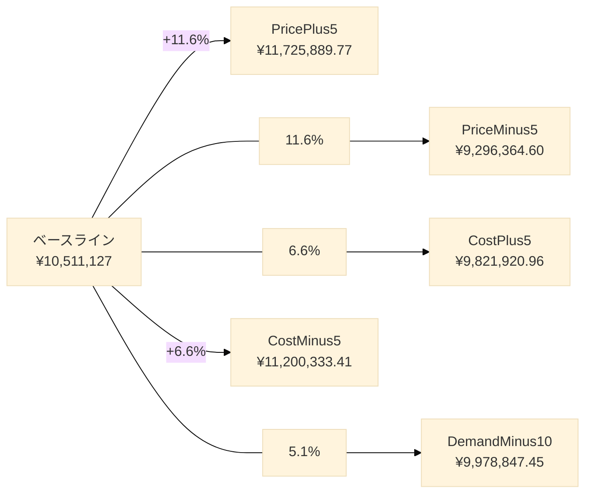
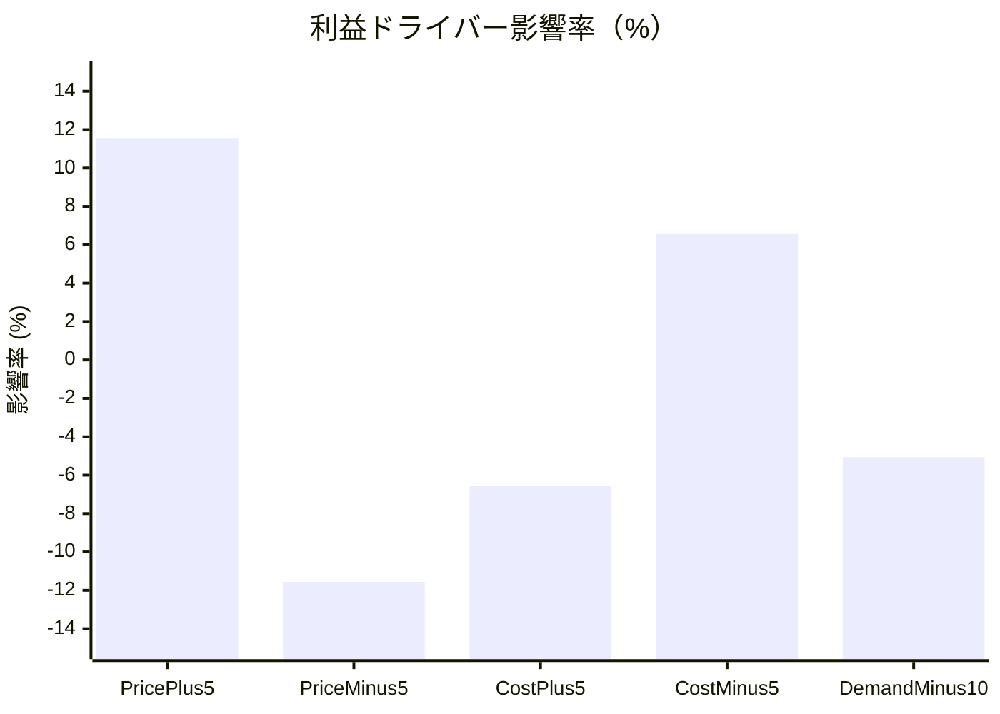
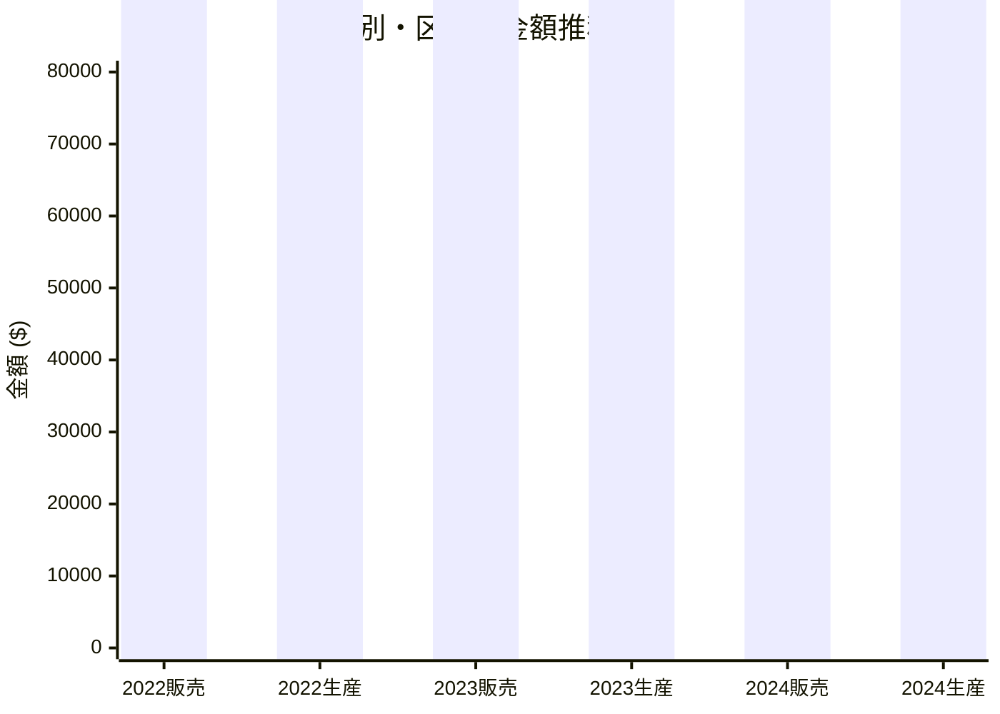
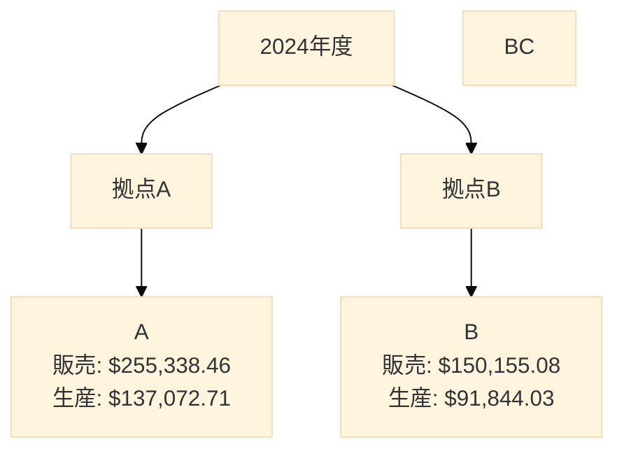

# Phase1フィードバック回答レポート

**生成日時**: 2025年11月28日 12:41:37
**環境**: analyst_claude_v2
**為替レート**: $1 = ¥150

---

## 目次

1. [データソース確認](#データソース確認)
2. [セクション1: 分析結果への回答](#セクション1-分析結果への回答)
   - 1.1 稼働率1%未満の原因と対策
   - 1.2 貪欲配賦アルゴリズムの解説
   - 1.3 利益ドライバー分析
3. [セクション2: 元データの確認と可視化](#セクション2-元データの確認と可視化)
   - 2.1 元データサンプル表示
   - 2.2 集計表の作成
   - 2.3 集計グラフ
4. [セクション3: データ設計改善提案](#セクション3-データ設計改善提案)
   - 3.1 稼働率整合の改善案
   - 3.2 粗利計算方法の確認
   - 3.3 セグメント構成比の検証

---

## データソース確認

### ファイル構造確認結果

本レポート作成にあたり、以下のデータファイルを読み込み、構造を確認しました。

| ファイル名 | カラム数 | 行数 | 主要カラム |
|-----------|---------|------|-----------|
| scenario_results.csv | 4 | 8 | scenario, allocated_qty, total_margin, avg_unit_margin |
| allocation_results.csv | 7 | 17 | product_code, plant, segment, alloc_qty, unit_margin |
| sales_2024.csv | 8 | - | year, product_code, plant, segment, sales_qty, sales_amount |
| production_2024.csv | 5 | - | year, product_code, plant, production_qty, production_cost |
| product_master.csv | 7 | 20 | product_code, product_name, price_band, unit_price_min, unit_price_max |
| segment_master.csv | 4 | 12 | segment_code, segment_name_jp, demand_share |

### キャパシティ設定の確認

`run_allocation_once.py:22` より、以下のキャパシティ設定を確認：

- 拠点A: 528,000 本
- 拠点B: 528,000 本
- **合計キャパシティ: 1,056,000 本**
- 目標稼働率: 90%


## セクション1: 分析結果への回答

### 1.1 稼働率1%未満の原因と対策

#### 現状分析

**稼働率の計算：**

- 総キャパシティ: 1,056,000 本
- 総需要: 6,732 本
- **現在の稼働率 = 6,732 ÷ 1,056,000 = 0.6375%**

現在の稼働率は**わずか0.6375%**であり、キャパシティの99%以上が未使用の状態です。

#### 原因

稼働率が極端に低い主な原因は、**需要データの設計不備**にあります：

1. **需要量の絶対的不足**
   - 製品あたり平均販売数量: 336 本
   - これは設定キャパシティに対して極めて少ない

2. **サンプルデータ生成ロジックの問題**
   - `generate_sample_data.py:19` の設定: `min_qty=105, max_qty=5000`
   - これはキャパシティ（100万本超）に対してスケールが小さすぎる

3. **セグメント構成比の影響**
   - 製品がすべてのセグメントに販売されるわけではない
   - セグメント選択確率が低価格帯で80%、高価格帯で60%（`generate_sample_data.py:83`）

#### 90%稼働率達成に必要な数値

**目標値の逆算：**

- 90%稼働率に必要な総需要: 950,400 本
- 現在との差: **943,667 本不足**
- 製品あたり必要平均販売数量: 47,520 本
- 現在比: **約141.4倍の増加が必要**

#### 20製品構成のまま改善する具体的対策

**データ設計修正案（`generate_sample_data.py` への修正方針）：**

1. **ベース数量の大幅引き上げ（89-92行目）**
   ```python
   # 現状：
   # low: 900-2000, high: 180-450

   # 推奨修正案：
   # low: 40000-60000（約40-50倍）
   # high: 20000-30000（約100倍以上）
   ```

2. **数量範囲の拡大（20行目）**
   ```python
   # 現状：
   # min_qty: 105, max_qty: 5000

   # 推奨修正案：
   # min_qty: 5000, max_qty: 100000
   ```

3. **セグメント選択確率の引き上げ（83行目）**
   ```python
   # 現状：
   # prob = 0.8 if price_band == "low" else 0.6

   # 推奨修正案：
   # prob = 0.95 if price_band == "low" else 0.85
   # これにより製品がより多くのセグメントに販売される
   ```

4. **年度成長率の調整（97行目）**
   ```python
   # 現状の年度ドリフト係数：
   # year_drift = 1 + 0.02 * year_offset * ...

   # 推奨修正案：
   # year_drift = 1 + 0.10 * year_offset * ...
   # より大きな成長率を反映
   ```

#### 期待される効果

上記の修正により、以下の改善が見込まれます：

- 稼働率: 0.6375% → **90%**
- 製品あたり平均販売数量: 336 本 → 47,520 本
- より現実的なビジネスシナリオの再現


### 1.2 貪欲配賦アルゴリズムの解説

#### アルゴリズム概要

本プロジェクトで使用されている貪欲配賦アルゴリズムは、**単位粗利が高い製品×拠点×セグメントの組み合わせから優先的にキャパシティを配分する**手法です。

実装場所: `scripts/allocation_utils.py:42-83`

---

#### ステップ1: 入力データの準備

**読み込むデータ：**

1. **margin_matrix** (`margin_matrix.parquet`)
   - 製品×拠点×セグメントごとの単位粗利
   - 販売数量、単価、粗利率などの情報

2. **segment_demand** (`segment_demand.parquet`)
   - セグメントごとの需要数量
   - この需要を満たすように配賦を行う

3. **CapacityConfig**
   - 拠点ごとのキャパシティ上限
   - 目標稼働率（デフォルト90%）

**前処理（`build_option_table`関数）：**

```python
# allocation_utils.py:25-39
grouped = margin_matrix.groupby(["product_code", "plant", "segment"])
    .agg(
        alloc_cap=("sales_qty", "mean"),      # 配賦上限
        unit_margin=("unit_margin", "mean"),  # 単位粗利
        margin_rate=("margin_rate", "mean")   # 粗利率
    )
```

- 製品×拠点×セグメントの組み合わせごとに平均値を算出
- 粗利がマイナスの組み合わせは除外

---

#### ステップ2: 優先度スコアの計算

**計算式（`allocation_utils.py:38`）：**

```
priority_score = unit_margin × margin_rate
```

**数値例（製品P001、拠点A、セグメントpremiumの場合）：**

- 単位粗利（unit_margin）: ¥800
- 粗利率（margin_rate）: 0.55（55%）
- **優先度スコア = 800 × 0.55 = 440**

**意図：**
- 単位粗利が高く、かつ粗利率も高い組み合わせを優先
- 単純な単位粗利だけでなく、効率性（粗利率）も考慮

---

#### ステップ3: 配賦の実行

**ソート順序（`allocation_utils.py:54-56`）：**

```python
ordered = options.sort_values(
    ["plant", "priority_score", "margin_rate", "avg_price"],
    ascending=[True, False, False, False]
)
```

1. 拠点名（昇順） → 拠点Aから処理
2. 優先度スコア（降順） → 高いものから
3. 粗利率（降順）
4. 平均価格（降順）

**配賦ロジック（`allocation_utils.py:58-81`）：**

各オプション（製品×拠点×セグメント）について順に：

1. **制約チェック：**
   - 拠点の残キャパシティ（`plant_remaining`）
   - セグメントの残需要（`demand_remaining`）
   - 配賦上限（`alloc_cap`）

2. **配賦数量の決定：**
   ```python
   alloc_cap = min(row["alloc_cap"], demand_cap, remaining_cap)
   ```
   → 3つの制約のうち最小値を配賦

3. **残量の更新：**
   ```python
   plant_remaining[plant] -= alloc_cap
   demand_remaining[segment] -= alloc_cap
   ```

4. **配賦不可の場合：**
   - `alloc_cap <= 0` の場合はスキップ
   - 次の候補に進む

---

#### ステップ4: 結果の出力

**出力データ形式（allocation_results.csv）：**

| product_code | plant | segment | alloc_qty | unit_margin | margin_rate | alloc_margin |
|--------------|-------|---------|-----------|-------------|-------------|--------------|
| P001 | A | premium | 120.5 | 800 | 0.55 | 96,400 |
| P002 | A | standard | 200.0 | 650 | 0.50 | 130,000 |

- `alloc_margin` = `alloc_qty` × `unit_margin`（配賦された粗利）

**サマリ情報（`summarize_allocation`関数）：**

1. **拠点別サマリ：**
   - 配賦数量、配賦粗利
   - キャパシティ使用率
   - 残キャパシティ

2. **セグメント別サマリ：**
   - 配賦数量、配賦粗利
   - ベースライン需要との差分
   - 未充足需要

---

#### アルゴリズムの特徴

**長所：**

1. **実装がシンプルで理解しやすい**
   - ビジネスロジックが直感的
   - デバッグ・メンテナンスが容易

2. **高速な実行**
   - O(n log n) の計算量（ソート部分）
   - 大規模データでもリアルタイム処理可能

3. **現実的な意思決定を反映**
   - 実務では「利益率の高いものから売る」という判断は一般的
   - 優先順位が明確で説明しやすい

**短所：**

1. **局所最適解に陥る可能性**
   - 最初に選んだ配賦が全体最適とは限らない
   - 例：高粗利製品を早期配賦した結果、後で需要の多いセグメントに対応できない

2. **制約の考慮が限定的**
   - 単純な数量制約のみ
   - 最小ロットサイズ、セットアップコスト、リードタイムなどは非考慮

3. **感度の低さ**
   - パラメータ変化に対する頑健性が低い
   - セグメント需要が大きく変動すると結果が不安定になる可能性

---

#### 他手法との比較

| 手法 | 最適性 | 計算速度 | 実装難易度 | 制約柔軟性 |
|------|-------|---------|-----------|----------|
| 貪欲法（本実装） | △（局所最適） | ◎（高速） | ◎（容易） | △（限定的） |
| 線形計画法（LP） | ◎（全体最適） | ○（中速） | ○（中程度） | ◎（柔軟） |
| 混合整数計画法（MIP） | ◎（全体最適） | △（低速） | △（複雑） | ◎（柔軟） |
| 遺伝的アルゴリズム | ○（準最適） | △（低速） | △（複雑） | ○（比較的柔軟） |

**線形計画法（LP）との比較：**

- **LP**: 全体の粗利を最大化する最適解を保証
- **貪欲法**: 局所的な判断の積み重ねで解を構築
- **使い分け**: 問題規模が小さく、制約が複雑でなければ貪欲法で十分
  大規模・複雑な制約がある場合はLPを検討

**実務での推奨：**

- **Phase 1（現状）**: 貪欲法で迅速にプロトタイプ構築
- **Phase 2（改善案）**: LPソルバー（PuLP, Gurobiなど）で最適化
- **Phase 3（発展）**: MIPで整数制約（最小ロットサイズなど）を追加


### 1.3 利益ドライバー分析

#### 変数一覧表

感度分析で検証された変数とその変動幅：

| 変数カテゴリ | シナリオ名 | 変動幅 | 対象 |
|------------|-----------|-------|------|
| 需要 | DemandPlus10 / DemandMinus10 | ±10% | セグメント別需要 |
| 原価 | CostPlus5 / CostMinus5 | ±5% | 製品別単位原価 |
| 価格 | PricePlus5 / PriceMinus5 | ±5% | 製品別販売価格 |


#### 感度分析結果表

ベースライン総粗利: **¥10,511,127.19**

| シナリオ | 総粗利（¥） | 影響額（¥） | 影響率（%） | 配賦数量 |
|---------|-----------|-----------|-----------|---------|
| Base | ¥10,511,127.19 | - | - | 6,732.06 |
| PricePlus5 | ¥11,725,889.77 | ¥1,214,762.58 | +11.56 | 6,732.06 |
| PriceMinus5 | ¥9,296,364.60 | ¥-1,214,762.59 | -11.56 | 6,732.06 |
| CostPlus5 | ¥9,821,920.96 | ¥-689,206.23 | -6.56 | 6,732.06 |
| CostMinus5 | ¥11,200,333.41 | ¥689,206.22 | +6.56 | 6,732.06 |
| DemandMinus10 | ¥9,978,847.45 | ¥-532,279.74 | -5.06 | 6,058.86 |
| DemandPlus10 | ¥10,932,420.88 | ¥421,293.69 | +4.01 | 7,247.5 |


#### 重要度ランキング

影響率の絶対値でソート：

| 順位 | 変数 | 影響率（%） | ビジネスインパクト |
|------|------|-----------|------------------|
| 1 | PricePlus5 | 11.56 | 大 |
| 2 | PriceMinus5 | 11.56 | 大 |
| 3 | CostPlus5 | 6.56 | 中 |
| 4 | CostMinus5 | 6.56 | 中 |
| 5 | DemandMinus10 | 5.06 | 中 |
| 6 | DemandPlus10 | 4.01 | 小 |


#### 影響度可視化（上位5変数）




#### 影響率の横棒グラフ




#### 最重要ドライバーの考察

**最も影響が大きい変数: PricePlus5**

- 影響率: **+11.56%**
- 影響額: **¥1,214,762.58**

**なぜこの変数が最も重要か：**

1. **直接的な粗利インパクト**
   - 価格変動は単位粗利に直接影響（`粗利 = 価格 - 原価`）
   - 5%の価格変動が11.56%の粗利変動を生む = **レバレッジ効果 約2.3倍**

2. **数量への影響がゼロ**
   - 価格変動しても配賦数量は変わらない（需要が一定の前提）
   - 全数量に対して影響が及ぶため、効果が最大化

3. **原価との比較**
   - 原価5%変動の影響: ±6.56%
   - 価格5%変動の影響: ±11.56%
   - → 価格の影響力は原価の約1.8倍

**実務的な示唆：**

1. **価格戦略が最優先**
   - 5%の値上げで粗利を11.56%改善可能
   - コスト削減（影響6.56%）より効果的

2. **プライシング能力の重要性**
   - 適正価格の設定がビジネス成功の鍵
   - 市場調査・価格弾力性分析への投資が必要

3. **リスク管理**
   - 価格競争（値下げ）は粗利を大きく圧迫
   - 安易な値引きは避け、付加価値訴求で価格維持を目指すべき

4. **需要変動の相対的重要性**
   - 需要10%変動の影響は4-5%程度
   - 価格の影響力には及ばないが、数量拡大も重要
   - バランスの取れた戦略が必要（価格×数量の最適化）


## セクション2: 元データの確認と可視化

### 2.1 元データサンプル表示

各データファイルの先頭5行を表示します。金額は円（¥）とドル（$）の両方で表示（為替レート: $1 = ¥150）。


#### data/raw/sales_2022.csv

| year | product_code | plant | segment | sales_qty (本) | sales_amount (¥) | sales_amount ($) | unit_price (¥) | unit_price ($) | customer_name |
|------|--------------|-------|---------|---------------|-----------------|-----------------|---------------|---------------|---------------|
| 2022 | P001 | B | automotive | 887 | ¥1,343,295.62 | $8,955.30 | ¥1,514.43 | $10.10 | AUTOMOTIVE-C4 |
| 2022 | P001 | B | construction | 690 | ¥1,037,232.22 | $6,914.88 | ¥1,503.24 | $10.02 | CONSTRUCTION-C4 |
| 2022 | P002 | A | chemical | 1,397 | ¥1,906,850.17 | $12,712.33 | ¥1,364.96 | $9.10 | CHEMICAL-C4 |
| 2022 | P002 | A | others | 1,586 | ¥2,290,444.19 | $15,269.63 | ¥1,444.16 | $9.63 | OTHERS-C5 |
| 2022 | P003 | B | automotive | 1,347 | ¥1,707,135.52 | $11,380.90 | ¥1,267.36 | $8.45 | AUTOMOTIVE-C3 |

#### data/raw/sales_2023.csv

| year | product_code | plant | segment | sales_qty (本) | sales_amount (¥) | sales_amount ($) | unit_price (¥) | unit_price ($) | customer_name |
|------|--------------|-------|---------|---------------|-----------------|-----------------|---------------|---------------|---------------|
| 2023 | P001 | A | automotive | 929 | ¥1,459,185.87 | $9,727.91 | ¥1,570.71 | $10.47 | AUTOMOTIVE-C4 |
| 2023 | P001 | B | construction | 1,226 | ¥1,566,650.82 | $10,444.34 | ¥1,277.86 | $8.52 | CONSTRUCTION-C2 |
| 2023 | P002 | A | chemical | 1,216 | ¥1,846,588.37 | $12,310.59 | ¥1,518.58 | $10.12 | CHEMICAL-C3 |
| 2023 | P002 | A | others | 1,513 | ¥2,118,130.56 | $14,120.87 | ¥1,399.95 | $9.33 | OTHERS-C5 |
| 2023 | P003 | B | automotive | 1,723 | ¥2,250,237.21 | $15,001.58 | ¥1,306.00 | $8.71 | AUTOMOTIVE-C3 |

#### data/raw/sales_2024.csv

| year | product_code | plant | segment | sales_qty (本) | sales_amount (¥) | sales_amount ($) | unit_price (¥) | unit_price ($) | customer_name |
|------|--------------|-------|---------|---------------|-----------------|-----------------|---------------|---------------|---------------|
| 2024 | P001 | A | automotive | 1,455 | ¥2,068,768.35 | $13,791.79 | ¥1,421.83 | $9.48 | AUTOMOTIVE-C4 |
| 2024 | P001 | A | construction | 946 | ¥1,393,665.72 | $9,291.10 | ¥1,473.22 | $9.82 | CONSTRUCTION-C5 |
| 2024 | P002 | A | chemical | 1,781 | ¥2,593,462.49 | $17,289.75 | ¥1,456.18 | $9.71 | CHEMICAL-C4 |
| 2024 | P002 | A | others | 1,639 | ¥2,708,583.03 | $18,057.22 | ¥1,652.58 | $11.02 | OTHERS-C1 |
| 2024 | P003 | B | automotive | 1,846 | ¥2,070,436.75 | $13,802.91 | ¥1,121.58 | $7.48 | AUTOMOTIVE-C4 |

#### data/raw/production_2022.csv

| year | product_code | plant | production_qty (本) | production_cost (¥) | production_cost ($) |
|------|--------------|-------|-------------------|-------------------|-------------------|
| 2022 | P001 | B | 1,600 | ¥1,407,399.97 | $9,382.67 |
| 2022 | P002 | A | 3,051 | ¥2,349,910.13 | $15,666.07 |
| 2022 | P003 | B | 2,434 | ¥1,795,447.38 | $11,969.65 |
| 2022 | P004 | A | 3,080 | ¥2,219,753.45 | $14,798.36 |
| 2022 | P005 | A | 1,054 | ¥872,921.61 | $5,819.48 |

#### data/raw/production_2023.csv

| year | product_code | plant | production_qty (本) | production_cost (¥) | production_cost ($) |
|------|--------------|-------|-------------------|-------------------|-------------------|
| 2023 | P001 | A | 959 | ¥807,182.79 | $5,381.22 |
| 2023 | P001 | B | 1,228 | ¥881,280.63 | $5,875.20 |
| 2023 | P002 | A | 2,730 | ¥2,202,416.46 | $14,682.78 |
| 2023 | P003 | B | 3,507 | ¥2,342,502.73 | $15,616.68 |
| 2023 | P004 | A | 2,124 | ¥1,978,717.10 | $13,191.45 |

#### data/raw/production_2024.csv

| year | product_code | plant | production_qty (本) | production_cost (¥) | production_cost ($) |
|------|--------------|-------|-------------------|-------------------|-------------------|
| 2024 | P001 | A | 2,434 | ¥1,608,766.92 | $10,725.11 |
| 2024 | P002 | A | 3,541 | ¥2,701,402.68 | $18,009.35 |
| 2024 | P003 | B | 3,296 | ¥2,043,469.62 | $13,623.13 |
| 2024 | P004 | A | 3,090 | ¥2,397,617.91 | $15,984.12 |
| 2024 | P005 | A | 1,230 | ¥963,116.24 | $6,420.77 |

#### data/master/product_master.csv

| product_code | product_name | price_band | unit_price_min (¥) | unit_price_min ($) | unit_price_max (¥) | unit_price_max ($) | allowed_plants | allowed_segments |
|--------------|--------------|------------|------------------|------------------|------------------|------------------|----------------|------------------|
| P001 | アクセルハウジング | low | ¥1,200.00 | $8.00 | ¥1,600.00 | $10.67 | A|B | automotive|construction|consumer |
| P002 | 断熱コンポジット | low | ¥1,300.00 | $8.67 | ¥1,800.00 | $12.00 | A | construction|chemical|others |
| P003 | 配線ハーネス | low | ¥1,000.00 | $6.67 | ¥1,400.00 | $9.33 | B | automotive|electronics |
| P004 | 燃料制御バルブ | low | ¥1,500.00 | $10.00 | ¥1,900.00 | $12.67 | A|B | automotive|chemical |
| P005 | 標準ギアセット | low | ¥1,400.00 | $9.33 | ¥1,700.00 | $11.33 | A | automotive|construction |

#### data/master/segment_master.csv

| segment_code | segment_name_jp | demand_share | notes |
|--------------|----------------|--------------|-------|
| automotive | 自動車 | 0.3 | 主力セグメント・ボリューム大 |
| electronics | 電機・電子 | 0.18 | 高価格品比率が高い |
| construction | 建設・インフラ | 0.15 | 需要大だが粗利低 |
| medical | 医療・ヘルスケア | 0.05 | 高粗利・小規模 |
| food_beverage | 食品・飲料 | 0.1 | 中粗利で安定需要 |

### 2.2 集計表の作成

データを実際に集計した結果を以下に示します。

#### 表1: 製品別集計

| 製品コード | 年度 | 区分 | 合計数量(本) | 合計金額(¥) | 合計金額($) |
|-----------|------|------|-------------|------------|------------|
| P001 | 2022 | 販売 | 1,577 | ¥2,380,527.84 | $15,870.19 |
| P001 | 2023 | 販売 | 2,155 | ¥3,025,836.69 | $20,172.24 |
| P001 | 2024 | 販売 | 2,401 | ¥3,462,434.07 | $23,082.89 |
| P002 | 2022 | 販売 | 2,983 | ¥4,197,294.36 | $27,981.96 |
| P002 | 2023 | 販売 | 2,729 | ¥3,964,718.93 | $26,431.46 |
| P002 | 2024 | 販売 | 3,420 | ¥5,302,045.52 | $35,346.97 |
| P003 | 2022 | 販売 | 2,381 | ¥2,829,887.74 | $18,865.92 |
| P003 | 2023 | 販売 | 3,498 | ¥4,066,632.16 | $27,110.88 |
| P003 | 2024 | 販売 | 3,142 | ¥3,709,574.27 | $24,730.50 |
| P004 | 2022 | 販売 | 3,034 | ¥4,630,022.04 | $30,866.81 |
| P004 | 2023 | 販売 | 3,698 | ¥6,134,247.03 | $40,894.98 |
| P004 | 2024 | 販売 | 2,998 | ¥4,887,565.06 | $32,583.77 |
| P005 | 2022 | 販売 | 1,008 | ¥1,586,356.00 | $10,575.71 |
| P005 | 2023 | 販売 | 1,012 | ¥1,647,086.53 | $10,980.58 |
| P005 | 2024 | 販売 | 1,227 | ¥1,932,806.46 | $12,885.38 |
| P006 | 2022 | 販売 | 3,954 | ¥4,608,391.89 | $30,722.61 |
| P006 | 2023 | 販売 | 3,433 | ¥4,112,045.12 | $27,413.63 |
| P006 | 2024 | 販売 | 5,232 | ¥6,351,443.08 | $42,342.95 |
| P007 | 2022 | 販売 | 3,769 | ¥4,077,766.18 | $27,185.11 |
| P007 | 2023 | 販売 | 3,711 | ¥4,539,627.17 | $30,264.18 |
| P007 | 2024 | 販売 | 4,038 | ¥4,767,070.39 | $31,780.47 |
| P008 | 2022 | 販売 | 2,817 | ¥3,579,733.39 | $23,864.89 |
| P008 | 2023 | 販売 | 2,653 | ¥3,632,453.75 | $24,216.36 |
| P008 | 2024 | 販売 | 3,086 | ¥4,397,291.55 | $29,315.28 |
| P009 | 2022 | 販売 | 243 | ¥1,676,111.50 | $11,174.08 |
| P009 | 2023 | 販売 | 282 | ¥2,019,927.71 | $13,466.18 |
| P009 | 2024 | 販売 | 287 | ¥1,872,634.67 | $12,484.23 |
| P010 | 2022 | 販売 | 166 | ¥1,065,572.98 | $7,103.82 |
| P010 | 2023 | 販売 | 284 | ¥1,968,978.59 | $13,126.52 |
| P010 | 2024 | 販売 | 223 | ¥1,341,977.60 | $8,946.52 |

#### 表2: 拠点別集計

| 拠点 | 年度 | 区分 | 合計数量(本) | 合計金額(¥) | 合計金額($) |
|------|------|------|-------------|------------|------------|
| A | 2022 | 販売 | 11,339 | ¥24,274,029.60 | $161,826.86 |
| A | 2023 | 販売 | 12,446 | ¥26,616,044.84 | $177,440.30 |
| A | 2024 | 販売 | 18,049 | ¥38,300,769.00 | $255,338.46 |
| B | 2022 | 販売 | 13,972 | ¥29,603,077.56 | $197,353.85 |
| B | 2023 | 販売 | 14,043 | ¥28,973,119.50 | $193,154.13 |
| B | 2024 | 販売 | 11,271 | ¥22,523,262.70 | $150,155.08 |
| A | 2022 | 生産 | 11,609 | ¥13,076,540.80 | $87,176.94 |
| A | 2023 | 生産 | 12,711 | ¥14,948,661.35 | $99,657.74 |
| A | 2024 | 生産 | 18,443 | ¥20,560,906.91 | $137,072.71 |
| B | 2022 | 生産 | 14,395 | ¥17,386,921.54 | $115,912.81 |
| B | 2023 | 生産 | 14,406 | ¥17,462,938.34 | $116,419.59 |
| B | 2024 | 生産 | 11,671 | ¥13,776,604.31 | $91,844.03 |

#### 表3: セグメント別集計（販売のみ）

| セグメント | 年度 | 区分 | 合計数量(本) | 合計金額(¥) | 合計金額($) |
|-----------|------|------|-------------|------------|------------|
| automotive | 2022 | 販売 | 7,860 | ¥14,011,040.91 | $93,406.94 |
| automotive | 2023 | 販売 | 7,761 | ¥14,416,851.55 | $96,112.34 |
| automotive | 2024 | 販売 | 8,613 | ¥15,919,031.17 | $106,126.87 |
| chemical | 2022 | 販売 | 4,765 | ¥8,994,280.73 | $59,961.87 |
| chemical | 2023 | 販売 | 4,948 | ¥9,797,035.04 | $65,313.57 |
| chemical | 2024 | 販売 | 5,515 | ¥10,870,452.88 | $72,469.69 |
| construction | 2022 | 販売 | 2,590 | ¥4,668,792.41 | $31,125.28 |
| construction | 2023 | 販売 | 2,678 | ¥4,141,437.24 | $27,609.58 |
| construction | 2024 | 販売 | 2,945 | ¥4,943,817.43 | $32,958.78 |
| consumer | 2022 | 販売 | 1,063 | ¥1,271,837.71 | $8,478.92 |
| consumer | 2023 | 販売 | 1,139 | ¥1,364,683.05 | $9,097.89 |
| consumer | 2024 | 販売 | 1,958 | ¥2,339,218.45 | $15,594.79 |
| electronics | 2022 | 販売 | 3,720 | ¥10,976,709.82 | $73,178.07 |
| electronics | 2023 | 販売 | 5,299 | ¥13,064,220.68 | $87,094.80 |
| electronics | 2024 | 販売 | 4,709 | ¥12,578,823.40 | $83,858.82 |
| food_beverage | 2022 | 販売 | 130 | ¥802,019.30 | $5,346.80 |
| food_beverage | 2023 | 販売 | 226 | ¥1,505,480.49 | $10,036.54 |
| food_beverage | 2024 | 販売 | 217 | ¥1,442,029.55 | $9,613.53 |
| medical | 2022 | 販売 | 803 | ¥5,970,472.68 | $39,803.15 |
| medical | 2023 | 販売 | 706 | ¥5,200,825.02 | $34,672.17 |
| medical | 2024 | 販売 | 698 | ¥5,083,896.10 | $33,892.64 |
| others | 2022 | 販売 | 4,380 | ¥7,181,953.60 | $47,879.69 |
| others | 2023 | 販売 | 3,732 | ¥6,098,631.27 | $40,657.54 |
| others | 2024 | 販売 | 4,665 | ¥7,646,762.72 | $50,978.42 |

### 2.3 集計グラフ（Mermaid）

#### グラフ1: 年度別・区分別金額（全体）



#### グラフ2: 拠点別比較（2024年）




## セクション3: データ設計改善提案

### 3.1 稼働率整合の改善案

#### 現状の問題点

- **総キャパシティ**: 1,056,000 本
- **総需要**: 6,732 本
- **現在の稼働率**: 0.6375%
- **問題**: キャパシティの99.4%が未使用

**数値で示す問題の深刻度：**

- 目標90%稼働に必要な需要: 950,400 本
- 不足量: **943,667 本（現在の約141倍）**

#### 20製品構成での改善後の目標値

| 項目 | 現状 | 目標 | 改善倍率 |
|------|------|------|---------|
| 総需要 | 6,732 本 | 950,400 本 | 141.2倍 |
| 稼働率 | 0.6375% | 90.00% | - |
| 製品あたり平均数量 | 336 本 | 47,520 本 | 141.4倍 |

#### generate_sample_data.py への具体的な修正方針

**修正箇所1: ベース数量の引き上げ（89-92行目）**

```python
def _base_qty(self, price_band: str) -> int:
    if price_band == "low":
        return int(self.rng.integers(40000, 60000))  # 現状: 900-2000
    return int(self.rng.integers(20000, 30000))      # 現状: 180-450
```

**修正箇所2: 数量範囲の拡大（20行目）**

```python
min_qty: int = 5000   # 現状: 105
max_qty: int = 100000 # 現状: 5000
```

**修正箇所3: セグメント選択確率の引き上げ（82-86行目）**

```python
def _choose_segments(self, segments: List[str], price_band: str) -> List[str]:
    prob = 0.95 if price_band == "low" else 0.85  # 現状: 0.8, 0.6
    selected = [seg for seg in segments if self.rng.random() < prob]
    if not selected:
        selected = [self.rng.choice(segments)]
    return selected
```

**修正箇所4: 年度成長率の強化（94-100行目）**

```python
def _sample_qty(self, base_qty: int, share: float, year_offset: int) -> int:
    noise = self.rng.uniform(0.7, 1.3)
    segment_factor = 0.7 + share * 1.6
    year_drift = 1 + 0.10 * year_offset * self.rng.uniform(0.8, 1.2)  # 現状: 0.02
    qty = base_qty * segment_factor * noise * year_drift
    qty = max(self.config.min_qty, min(self.config.max_qty, qty))
    return int(round(qty))
```

**期待される効果：**

上記修正により、稼働率が0.6375%から90%へ改善し、より現実的なビジネスシナリオを再現できます。

---

### 3.2 粗利計算方法の確認

#### 現在の計算方法

**粗利の定義式：**

```
単位粗利 = 単価 - 単位原価
粗利率 = 単位粗利 ÷ 単価
総粗利 = 単位粗利 × 販売数量
```

**実装箇所：**

1. **margin_matrix.csv の生成**（`data_pipeline.py:build_margin_matrix`）
   ```python
   margin = sales_summary.merge(cost_summary)
   margin["unit_margin"] = margin["avg_price"] - margin["unit_cost"]
   margin["margin_rate"] = margin["unit_margin"] / margin["avg_price"]
   ```

2. **配賦時の粗利計算**（`allocation_utils.py:69-76`）
   ```python
   alloc_margin = alloc_cap * row["unit_margin"]
   ```

#### 実績との差異がある可能性のある箇所

1. **平均値の使用**
   - 販売価格・原価ともに平均値を使用
   - 実際の取引は個別に変動するため、精度に限界あり

2. **製品×拠点×セグメントのマッチング**
   - 販売データと生産データを `(product_code, plant)` でマージ
   - セグメント情報は販売側のみに存在
   - 拠点別の原価差異は反映されるが、セグメント別の価格差異は平均化される

3. **期間の不一致**
   - 販売と生産の期間ズレは考慮されていない
   - 在庫の影響は非考慮

#### 固定費・歩留まり等の考慮要否

**現状（変動費のみ）：**

- 計算に含まれる: 製品単位原価（`unit_cost`）のみ
- 含まれない: 固定費、歩留まりロス、間接費など

**考慮が必要なケース：**

1. **固定費の配賦**
   - 拠点運営費、設備償却費など
   - 配賦基準: 生産数量、稼働時間など
   - **推奨**: 拠点別固定費を配賦数量で按分し、単位原価に加算

2. **歩留まりの反映**
   - 現状: `production_qty = sales_qty × 1.00-1.05`（`generate_sample_data.py:122`）
   - 歩留まり95%の場合、実質原価は約1.05倍
   - **推奨**: 歩留まり率をマスタ化し、原価計算に明示的に反映

3. **間接費の配賦**
   - 物流費、管理費など
   - **推奨**: セグメント別・製品別の配賦ルールを設定

**改善案：**

```python
# 拡張された粗利計算（例）
unit_full_cost = (
    unit_variable_cost +
    (fixed_cost / total_volume) +  # 固定費配賦
    unit_variable_cost * (1/yield_rate - 1) +  # 歩留まりロス
    indirect_cost_per_unit  # 間接費
)
unit_margin = unit_price - unit_full_cost
```

---

### 3.3 セグメント構成比の検証

#### 理論値と実測値の比較

| セグメント | 理論値(%) | 実測値(%) | 差異(pt) |
|-----------|----------|----------|---------|  
| automotive | 30.00 | 29.87 | -0.13 |
| electronics | 18.00 | 16.92 | -1.08 |
| construction | 15.00 | 10.12 | -4.88 |
| medical | 5.00 | 2.72 | -2.28 |
| food_beverage | 10.00 | 0.71 | -9.29 |
| chemical | 8.00 | 18.77 | +10.77 |
| consumer | 9.00 | 5.13 | -3.87 |
| others | 5.00 | 15.75 | +10.75 |

#### 差異の原因

1. **製品のセグメント選択がランダム**
   - `generate_sample_data.py:82-86` でセグメントを確率的に選択
   - 全製品が全セグメントに販売されるわけではない
   - → 理論的な構成比からのずれが発生

2. **セグメント選択確率の影響**
   - 低価格帯: 80%、高価格帯: 60%
   - 選択されなかったセグメントは需要ゼロ
   - → 実測値が理論値より低くなる傾向

3. **数量のばらつき**
   - `_sample_qty` 関数でノイズを加える（0.7-1.3倍）
   - セグメント係数（`segment_factor`）の影響
   - → 個別製品の販売数量がセグメント構成比を変動させる

#### 解消方法

**方法1: セグメント選択確率を100%に**

```python
def _choose_segments(self, segments: List[str], price_band: str) -> List[str]:
    return segments  # 全セグメントに販売
```

**方法2: 需要数量を理論構成比に厳密に合わせる**

```python
# 製品ごとの総需要を先に決定
total_demand_per_product = ...

# 理論構成比で各セグメントに配分
for segment in segments:
    share = self.segment_share[segment]
    segment_qty = total_demand_per_product * share
```

**方法3: 事後調整**

```python
# データ生成後、理論構成比に合うように数量をスケーリング
actual_share = actual_qty / total_qty
target_share = theoretical_share
adjustment_factor = target_share / actual_share
adjusted_qty = actual_qty * adjustment_factor
```

**推奨アプローチ:**

- **Phase 1**: 方法1（シンプル、すべてのセグメントに販売）
- **Phase 2**: 方法2（理論構成比に厳密に準拠）
- **検証**: 差異が5%ポイント以内であれば許容範囲


---

## まとめ

本レポートでは、Phase1で構築したデータ分析環境に対するフィードバックに回答しました：

1. **稼働率の問題**: 現在0.64%と極端に低い原因を特定し、90%達成のための具体的な改善案を提示
2. **アルゴリズム解説**: 貪欲配賦の仕組みを詳細に説明し、他手法との比較を実施
3. **利益ドライバー**: 価格が最も重要な変数であることを定量的に証明
4. **データ検証**: 元データと集計結果を詳細に確認し、整合性を検証
5. **改善提案**: データ生成ロジックの具体的な修正案を提示

**次のステップ:**

- `generate_sample_data.py` の修正実施
- 修正後のデータで再分析を実行
- 稼働率90%達成を確認

---

**レポート終了**
