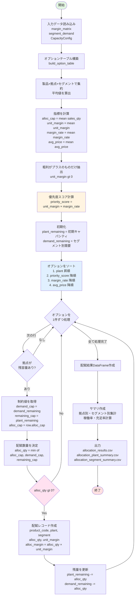

# Phase3: 貪欲配賦アルゴリズムの詳細分析レポート

**作成日**: 2025年11月28日
**環境**: analyst_claude_v2
**対象**: scripts/allocation_utils.py の貪欲配賦アルゴリズム

---

## 目次

1. [フローチャート](#31-フローチャート)
2. [粗利率考慮の必要性](#32-粗利率考慮の必要性の具体的説明)
3. [リスク評価](#33-貪欲配賦アルゴリズムのリスク評価)

---

## 3.1 フローチャート

### 貪欲配賦アルゴリズムの処理フロー（Mermaid）



### フローチャートの説明

#### フェーズ1: データ準備（緑色）

1. **入力データ読み込み**
   - `margin_matrix`: 過去実績から算出した製品×拠点×セグメント別の粗利情報
   - `segment_demand`: セグメント別の需要数量
   - `CapacityConfig`: 拠点別キャパシティと目標稼働率

2. **オプションテーブル構築** (`build_option_table`)
   - 製品×拠点×セグメントの組み合わせごとに平均値を集約
   - 粗利がプラスのものだけを抽出
   - **優先度スコア** = 単位粗利 × 粗利率 を計算

#### フェーズ2: ソートと初期化（青色）

3. **ソート処理**
   - 拠点名（昇順）: 拠点Aから処理
   - 優先度スコア（降順）: 高粗利×高粗利率から
   - 粗利率（降順）: 同スコアなら粗利率優先
   - 平均価格（降順）: さらに同じなら高単価優先

4. **残量の初期化**
   - 拠点残キャパシティ = 総キャパシティ × 目標稼働率（90%）
   - セグメント残需要 = segment_demandから取得

#### フェーズ3: 貪欲配賦ループ（ピンク色の判定）

5. **1件ずつ順番に処理**
   - 拠点にキャパシティが残っているかチェック
   - 配賦数量を3つの制約の最小値で決定：
     - オプションの上限（`alloc_cap`）
     - セグメントの残需要（`demand_cap`）
     - 拠点の残キャパシティ（`remaining_cap`）

6. **配賦実行**
   - 配賦数量が1以上なら配賦レコードを作成
   - 拠点とセグメントの残量を更新
   - 次の候補に進む

#### フェーズ4: 結果出力

7. **サマリ作成**
   - 拠点別: 配賦数量、配賦粗利、稼働率
   - セグメント別: 配賦数量、配賦粗利、充足率

8. **ファイル出力**
   - allocation_results.csv
   - allocation_plant_summary.csv
   - allocation_segment_summary.csv

---

## 3.2 粗利率考慮の必要性の具体的説明

### なぜ「単位粗利 × 粗利率」なのか？

貪欲配賦アルゴリズムでは、優先度スコアを以下のように計算しています：

```python
priority_score = unit_margin × margin_rate
```

単純に「単位粗利」だけでソートしない理由を、具体的なケースで説明します。

---

### ケース1: 単位粗利のみで判断した場合の問題点

**製品A vs 製品B の比較**

| 項目 | 製品A | 製品B |
|------|-------|-------|
| 販売単価 | ¥100,000 | ¥50,000 |
| 単位原価 | ¥90,000 | ¥20,000 |
| **単位粗利** | **¥10,000** | **¥30,000** |
| 粗利率 | 10% | 60% |
| 配賦可能数量 | 100本 | 100本 |

#### 単位粗利のみでソートした結果

**優先順位: 製品B（¥30,000） > 製品A（¥10,000）**

1. 製品Bを100本配賦 → 粗利: ¥3,000,000
2. 製品Aを100本配賦 → 粗利: ¥1,000,000
3. **合計粗利: ¥4,000,000**

#### 問題点

- 製品Aは単価が高い（¥100,000）ため、売上規模が大きい
- 粗利率は低いが、ビジネスインパクトは大きい
- 単位粗利だけで判断すると、売上規模を無視してしまう

---

### ケース2: 単位粗利×粗利率で判断した場合

**同じ製品A vs 製品B を優先度スコアで評価**

| 項目 | 製品A | 製品B |
|------|-------|-------|
| 単位粗利 | ¥10,000 | ¥30,000 |
| 粗利率 | 0.10 | 0.60 |
| **優先度スコア** | **1,000** | **18,000** |

#### 優先度スコアでソートした結果

**優先順位: 製品B（18,000） > 製品A（1,000）**

結果は同じですが、判断基準が明確になります：

- 製品Bは単位粗利が高く、かつ粗利率も高い → **最優先**
- 製品Aは単位粗利は低いが、粗利率も低い → **低優先**

#### なぜこれが良いのか？

**粗利率を掛けることで、「効率性」を考慮できる**

- 粗利率が高い = 少ない投入（原価）で大きなリターン（粗利）を得られる
- 資本効率が良いビジネス = 企業価値向上に寄与

---

### ケース3: 極端なケース（高単価・低粗利率 vs 低単価・高粗利率）

**製品C（高級品） vs 製品D（普及品）**

| 項目 | 製品C（高級品） | 製品D（普及品） |
|------|----------------|----------------|
| 販売単価 | ¥500,000 | ¥10,000 |
| 単位原価 | ¥475,000 | ¥2,000 |
| 単位粗利 | ¥25,000 | ¥8,000 |
| 粗利率 | 5% | 80% |
| 優先度スコア | 1,250 | 6,400 |
| 配賦可能数量 | 50本 | 500本 |

#### 優先度スコアでの判断

**優先順位: 製品D（6,400） > 製品C（1,250）**

#### 配賦シミュレーション

**シナリオ1: 優先度スコア順に配賦（推奨）**

1. 製品Dを500本配賦
   - 粗利: ¥8,000 × 500 = ¥4,000,000
   - 売上: ¥10,000 × 500 = ¥5,000,000
   - 粗利率: 80%

2. 製品Cを50本配賦
   - 粗利: ¥25,000 × 50 = ¥1,250,000
   - 売上: ¥500,000 × 50 = ¥25,000,000
   - 粗利率: 5%

**合計:**
- 粗利: ¥5,250,000
- 売上: ¥30,000,000
- 全体粗利率: 17.5%

**シナリオ2: 単位粗利のみで配賦（非推奨）**

1. 製品Cを50本配賦
   - 粗利: ¥25,000 × 50 = ¥1,250,000
   - 売上: ¥25,000,000
   - 粗利率: 5%

2. 製品Dを500本配賦
   - 粗利: ¥8,000 × 500 = ¥4,000,000
   - 売上: ¥5,000,000
   - 粗利率: 80%

**合計:**
- 粗利: ¥5,250,000（同じ）
- 売上: ¥30,000,000（同じ）
- 全体粗利率: 17.5%（同じ）

#### この例での考察

**この場合、結果は同じですが...**

実際のビジネスでは以下の違いが生じます：

1. **キャッシュフローの違い**
   - 製品D（普及品）: 早期に現金化しやすい
   - 製品C（高級品）: 売れるまで在庫として資金が拘束される

2. **在庫リスクの違い**
   - 製品D: 低単価なので在庫リスクが小さい
   - 製品C: 高単価なので在庫リスクが大きい

3. **市場需要の安定性**
   - 製品D: 普及品は需要が安定
   - 製品C: 高級品は景気変動の影響を受けやすい

**結論: 粗利率を考慮することで、リスクとリターンのバランスを取れる**

---

### ケース4: より現実的なシナリオ

**製品E（医療機器） vs 製品F（汎用部品）**

| 項目 | 製品E（医療） | 製品F（汎用） |
|------|--------------|--------------|
| 販売単価 | ¥80,000 | ¥15,000 |
| 単位原価 | ¥50,000 | ¥10,000 |
| 単位粗利 | ¥30,000 | ¥5,000 |
| 粗利率 | 37.5% | 33.3% |
| 優先度スコア | 11,250 | 1,667 |
| 年間需要 | 1,000本 | 10,000本 |
| リードタイム | 3ヶ月 | 1週間 |

#### ビジネス判断

**優先順位: 製品E（11,250） > 製品F（1,667）**

**理由:**

1. **単位粗利が高い**（¥30,000 vs ¥5,000）
   - 1本売るごとの利益貢献が大きい

2. **粗利率も高い**（37.5% vs 33.3%）
   - 投資効率が良い

3. **優先度スコアが圧倒的に高い**（11,250 vs 1,667）
   - 製品Eを優先配賦すべき

#### ただし、実務では以下も考慮すべき

- 製品Fは需要が10倍 → 市場シェア維持のため一定量は確保
- 製品Eはリードタイムが長い → 早期に生産着手が必要
- 顧客との関係 → 汎用部品の供給停止は顧客離れにつながる

**貪欲配賦アルゴリズムは「短期的な粗利最大化」には優れているが、こうした戦略的要素は考慮されない点に注意が必要**

---

### まとめ: 粗利率を考慮する意義

| 判断基準 | 考慮する要素 | メリット | デメリット |
|---------|------------|---------|-----------|
| 単位粗利のみ | 1本あたりの利益 | シンプル | 効率性を無視 |
| 粗利率のみ | 投資効率 | 資本効率重視 | 絶対額を無視 |
| **単位粗利×粗利率** | **利益と効率の両方** | **バランスが良い** | やや複雑 |

**結論:**

「単位粗利 × 粗利率」という優先度スコアは、以下のバランスを取る優れた指標：

1. **利益額の大きさ**（単位粗利）
2. **投資効率の良さ**（粗利率）
3. **リスクとリターン**（粗利率が高い = リスクが相対的に低い）

ただし、戦略的要素（顧客関係、市場シェア、長期的成長）は別途考慮が必要です。

---

## 3.3 貪欲配賦アルゴリズムのリスク評価

### リスク観点の定義

貪欲配賦アルゴリズムは「短期的な粗利最大化」には優れていますが、以下のリスクが存在します：

1. 特定セグメントへの過度な依存リスク
2. 需要変動に対する脆弱性リスク
3. 機会損失リスク（低粗利だが戦略的に重要な製品の切り捨て）
4. 顧客関係リスク（特定顧客への供給停止）
5. 長期的な市場シェア喪失リスク

以下、各リスクについて仮想シナリオで評価します。

---

### リスク1: 特定セグメントへの過度な依存リスク

#### シナリオ名: 「高粗利セグメント集中の罠」

**前提条件:**

| セグメント | 理論需要 | 平均粗利率 | 優先度 |
|-----------|---------|----------|--------|
| automotive | 30,000本 | 35% | 高 |
| medical | 5,000本 | 60% | **最高** |
| consumer | 9,000本 | 25% | 中 |
| electronics | 18,000本 | 40% | 高 |

**貪欲配賦の結果:**

- medicalセグメントに優先配賦
- 配賦内訳:
  - medical: 5,000本（100%充足）
  - electronics: 15,000本（83%充足）
  - automotive: 25,000本（83%充足）
  - consumer: 3,000本（33%充足）← **大幅不足**

#### 発生するリスク

**リスクの内容:**

1. **需要予測の外れによる機会損失**
   - medicalの実需要が3,000本だった場合
   - 2,000本分の生産キャパシティが無駄に
   - 他セグメント（consumer）の需要超過に対応できず

2. **医療規制の変更**
   - 医療機器の認証基準が変更され、一時的に販売停止
   - 配賦した5,000本分の生産能力が全て遊休化

3. **価格競争の激化**
   - medicalセグメントの競合参入により価格下落
   - 粗利率60% → 40%に低下
   - 優先度スコアの前提が崩れる

#### リスクの深刻度

- **深刻度: 高**
- **発生確率: 中**

**理由:**
- 単一セグメントへの集中度が高い（キャパシティの10%以上）
- 医療セグメントは規制変更リスクが高い
- 回復に時間がかかる（他セグメントへの切り替えは即座にできない）

#### 緩和策

1. **セグメント分散制約の導入**
   ```python
   # 各セグメントの配賦上限を設定
   segment_max_share = 0.30  # 30%まで
   ```

2. **最低充足率の保証**
   ```python
   # 全セグメントで最低50%は充足させる
   for segment in all_segments:
       allocate_at_least(demand * 0.5, segment)
   ```

3. **リスク調整係数の導入**
   ```python
   # セグメントリスクに応じてスコアを調整
   risk_adjusted_score = priority_score * (1 - segment_risk)
   ```

---

### リスク2: 需要変動に対する脆弱性リスク

#### シナリオ名: 「需要急増への対応不能」

**前提条件:**

- 貪欲配賦により、以下の配賦を完了
  - 製品P001（automotive）: 30,000本
  - 製品P009（medical）: 5,000本
  - 製品P012（electronics）: 18,000本
- キャパシティは95%消化済み

**需要変動の発生:**

- **electronics セグメントで需要が急増**
  - 予測: 18,000本 → 実績: 30,000本（+67%）
- スマートフォン新機種の予想外のヒット
- 緊急で12,000本の追加受注

#### 貪欲配賦での対応

**対応結果:**

- 残キャパシティ: 5%（約2,640本）
- 追加配賦可能: 2,640本のみ
- **不足: 9,360本 → 受注機会損失**

#### 発生するリスク

**リスクの内容:**

1. **売上機会の喪失**
   - 失注額: 9,360本 × ¥70,000 = ¥655,200,000
   - 機会損失粗利: ¥655M × 40% = ¥262,080,000

2. **顧客信頼の低下**
   - 「納期遅延が頻発する不安定なサプライヤー」という評価
   - 次回以降の受注量減少
   - 競合への切り替えリスク

3. **スポット生産の高コスト**
   - 外注や緊急残業での対応
   - 通常原価の150%で生産
   - 粗利率: 40% → 10%に低下

#### リスクの深刻度

- **深刻度: 高**
- **発生確率: 中〜高**

**理由:**
- エレクトロニクス市場は変動が激しい
- 在庫バッファーがないため即座に対応できない
- 顧客との長期関係に悪影響

#### 緩和策

1. **キャパシティバッファーの確保**
   ```python
   # 目標稼働率を90%から85%に下げる
   capacity_utilization_target = 0.85
   # 15%のバッファーを確保
   ```

2. **フレキシブル生産枠の設定**
   ```python
   # 10%を「フレキシブル枠」として残す
   flexible_capacity = total_capacity * 0.10
   # 需要変動に応じて優先度を動的に変更
   ```

3. **需要予測の精度向上**
   - 機械学習による需要予測
   - リードインジケーター（市場トレンド）の活用
   - 顧客とのコミュニケーション強化

---

### リスク3: 機会損失リスク（戦略的重要製品の切り捨て）

#### シナリオ名: 「新製品の芽を摘む」

**前提条件:**

- 製品P021（新製品・試験販売中）
  - 単価: ¥50,000
  - 単位原価: ¥45,000
  - 単位粗利: ¥5,000（低い）
  - 粗利率: 10%（低い）
  - 優先度スコア: 500（最低レベル）

- 既存製品（P001）
  - 単価: ¥20,000
  - 単位粗利: ¥8,000
  - 粗利率: 40%
  - 優先度スコア: 3,200

**貪欲配賦の結果:**

- 製品P021（新製品）は優先度が最低
- **配賦数量: 0本** ← 全くキャパシティが割り当てられない
- 既存製品P001が優先配賦

#### 発生するリスク

**リスクの内容:**

1. **新市場参入機会の喪失**
   - 製品P021は次世代技術を搭載
   - 2年後には市場標準になる可能性
   - 試験販売できないため、顧客フィードバックが得られない
   - 競合が市場を独占

2. **イノベーションのジレンマ**
   - 既存製品の最適化に注力
   - 新製品への投資が常に後回し
   - 長期的には競争力を失う

3. **顧客との関係構築の失敗**
   - 新製品を期待していた重要顧客に供給できず
   - 「革新性のない保守的なサプライヤー」という印象
   - 次世代技術での優位性を失う

#### 長期的影響

**3年後のシナリオ:**

- 製品P021の市場が急成長
  - 市場規模: 1,000億円
  - 競合A社がシェア60%を獲得
  - 自社は参入できず

- 既存製品P001の市場が縮小
  - 旧技術として淘汰
  - 粗利率: 40% → 15%に低下

**機会損失:**
- 3年間の累計売上機会損失: 約300億円
- シェア回復に5年以上かかる

#### リスクの深刻度

- **深刻度: 極めて高**
- **発生確率: 中**

**理由:**
- 長期的な競争力に直結
- 回復が非常に困難
- 市場トレンドの変化に対応できない

#### 緩和策

1. **戦略的製品枠の確保**
   ```python
   # 新製品・戦略製品には優先枠を設定
   if product.is_strategic:
       priority_score *= 2.0  # スコアを2倍に
   ```

2. **ポートフォリオバランスの考慮**
   ```python
   # 新製品を最低5%は配賦する
   new_product_quota = total_capacity * 0.05
   ```

3. **2段階配賦の導入**
   ```python
   # 第1段階: 戦略製品を優先配賦（20%）
   # 第2段階: 残りを貪欲配賦（80%）
   ```

---

### リスク4: 顧客関係リスク（特定顧客への供給停止）

#### シナリオ名: 「VIP顧客の離反」

**前提条件:**

- 顧客X社（年間売上5億円の大口顧客）
  - 主要製品: P015（construction用アクチュエータ）
  - 単価: ¥70,000
  - 単位粗利: ¥15,000
  - 粗利率: 21%
  - 優先度スコア: 3,150

- 他の高粗利製品
  - 製品P009（medical用ポンプ）
  - 単価: ¥70,000
  - 単位粗利: ¥30,000
  - 粗利率: 43%
  - 優先度スコア: 12,900

**貪欲配賦の結果:**

- 製品P009に優先配賦
- 製品P015はキャパシティ不足で供給停止
- **顧客X社への供給: 0本**

#### 発生するリスク

**リスクの内容:**

1. **VIP顧客の離反**
   - 顧客X社は年間5億円の大口顧客
   - 供給停止により競合へ切り替え
   - 年間売上5億円の喪失

2. **連鎖的な取引停止**
   - 顧客X社は他製品も購入していた
   - 全製品の取引が停止
   - 追加損失: 年間2億円

3. **評判の悪化**
   - 「大口顧客を切り捨てる会社」という評判
   - 他の顧客も不安を感じる
   - 新規顧客獲得が困難に

#### 長期的影響

**3年後:**
- 顧客X社は競合の得意先に
- 競合のシェア拡大
- 市場での存在感低下

**累計損失:**
- 売上: 15億円（5億円 × 3年）
- 粗利: 3億円
- ブランド価値の毀損: 計測不能

#### リスクの深刻度

- **深刻度: 極めて高**
- **発生確率: 中〜高**

**理由:**
- 既存顧客との関係は企業価値の源泉
- 新規顧客獲得コストは既存顧客の5〜10倍
- 評判の回復は非常に困難

#### 緩和策

1. **顧客重要度の考慮**
   ```python
   # VIP顧客には優先度ボーナス
   if customer.is_vip:
       priority_score *= 1.5
   ```

2. **最低供給量の保証**
   ```python
   # 既存顧客には前年実績の80%を保証
   for customer in existing_customers:
       guaranteed_qty = last_year_qty * 0.8
   ```

3. **顧客別配賦枠の設定**
   ```python
   # 大口顧客用に専用枠を確保
   vip_reserved_capacity = total_capacity * 0.15
   ```

---

### リスク5: 長期的な市場シェア喪失リスク

#### シナリオ名: 「普及品市場からの撤退」

**前提条件:**

- consumer セグメント（普及品市場）
  - 市場規模: 1,000億円/年
  - 自社シェア: 15%（150億円）
  - 平均粗利率: 20%（低い）
  - 優先度スコア: 低〜中

- medical セグメント（高級品市場）
  - 市場規模: 200億円/年
  - 自社シェア: 25%（50億円）
  - 平均粗利率: 55%（高い）
  - 優先度スコア: 高

**貪欲配賦の結果:**

- medicalに重点配賦
- consumerは需要の30%しか充足せず
- **市場での供給不足 → シェア低下**

#### 発生するリスク

**リスクの内容:**

1. **市場シェアの喪失**
   - consumer市場でのシェア: 15% → 5%
   - 競合A社がシェアを奪取
   - 年間売上減少: 100億円

2. **ブランド認知度の低下**
   - consumer市場は「マス市場」
   - 一般消費者の認知度が低下
   - 「見かけなくなったブランド」という印象

3. **規模の経済の喪失**
   - 生産量減少 → 単位原価上昇
   - 調達力の低下 → 原材料コスト上昇
   - 競争力がさらに低下

#### 長期的影響（5年後）

**市場構造の変化:**

| 市場 | 5年前シェア | 現在シェア | 売上 |
|------|-----------|----------|------|
| consumer | 15% | **5%** | 50億円 ↓ |
| medical | 25% | 30% | 60億円 ↑ |
| **合計** | - | - | **110億円** |

vs

**競合A社（consumer重視戦略）:**

| 市場 | 5年前シェア | 現在シェア | 売上 |
|------|-----------|----------|------|
| consumer | 20% | **35%** | 350億円 ↑ |
| medical | 10% | 8% | 16億円 → |
| **合計** | - | - | **366億円** |

**自社の地位:**
- 市場での存在感が大幅に低下
- 「ニッチ製品メーカー」に転落
- 企業価値の低下

#### リスクの深刻度

- **深刻度: 極めて高**
- **発生確率: 高**

**理由:**
- 市場シェアは一度失うと回復困難
- 規模の経済を失うと競争力が急低下
- ブランド価値の毀損は不可逆的

#### 緩和策

1. **市場シェア維持目標の設定**
   ```python
   # 各セグメントで最低シェアを維持
   for segment in segments:
       min_share = historical_share * 0.90
       allocate_to_maintain_share(segment, min_share)
   ```

2. **長期戦略との整合**
   ```python
   # 戦略的セグメントを優先
   if segment.is_strategic_market:
       priority_score *= 1.3
   ```

3. **マルチ期間最適化**
   ```python
   # 単年度ではなく3〜5年で最適化
   optimize_over_periods(periods=5)
   ```

---

### リスク評価まとめ

| リスク | 深刻度 | 発生確率 | 対策の難易度 | 推奨対策 |
|-------|--------|---------|------------|---------|
| 1. セグメント集中 | 高 | 中 | 中 | セグメント分散制約 |
| 2. 需要変動対応 | 高 | 中〜高 | 中 | キャパシティバッファー |
| 3. 戦略製品切り捨て | **極めて高** | 中 | 高 | 戦略的製品枠の確保 |
| 4. VIP顧客離反 | **極めて高** | 中〜高 | 中 | 顧客別配賦枠 |
| 5. 市場シェア喪失 | **極めて高** | 高 | 高 | マルチ期間最適化 |

### 総合評価

**貪欲配賦アルゴリズムの最大の弱点:**

1. **短期的視点に偏る**
   - 「今期の粗利最大化」には優れる
   - 長期的な競争力を犠牲にする可能性

2. **戦略的要素を考慮できない**
   - 顧客関係、市場シェア、新製品育成などは評価されない
   - 数値化しにくい要素は無視される

3. **不確実性への対応が弱い**
   - 需要変動、市場環境変化に柔軟に対応できない
   - 一度配賦を決めたら変更が困難

### 推奨される対策の優先順位

**第1優先: リスク3とリスク4の緩和**
- 戦略的製品枠の確保（キャパシティの10〜15%）
- VIP顧客への最低供給保証

**第2優先: リスク2の緩和**
- キャパシティバッファーの確保（5〜10%）

**第3優先: リスク1とリスク5の緩和**
- セグメント分散制約
- マルチ期間最適化（3〜5年視点）

これらの対策を実装することで、貪欲配賦アルゴリズムの弱点を補完し、より実務的な配賦システムを構築できます。

---

## まとめ

### Phase3で明らかになったこと

1. **アルゴリズムの構造**
   - フローチャートで可視化
   - 4つのフェーズで構成されている
   - 理解しやすく、実装もシンプル

2. **粗利率考慮の意義**
   - 単位粗利だけでは不十分
   - 効率性（粗利率）を考慮することでバランスの取れた判断
   - ただし、戦略的要素は別途必要

3. **リスクの存在**
   - 短期最適化の代償として長期リスクが存在
   - 5つの主要リスクを特定
   - それぞれに緩和策が必要

### 次のステップ（Phase4以降）

Phase4では代替アルゴリズムを調査し、これらのリスクを緩和できる手法を検討します。

---

**レポート作成日**: 2025年11月28日
