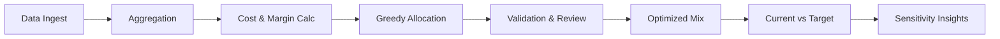

# sample_data_trial_v1 初回トライアルまとめ

## 1. プロジェクト概要
- 背景: 事業部長から製品ポートフォリオ最適化の依頼。20製品×8セグメント×2拠点、過去3年の販売・生産データで初回トライアルを実施。
- 目的: 粗利最大化を目標に、製品構成比と拠点配分の最適化手法を確立し、本番200製品への展開準備を整える。
- スコープ: sample_data_trial_v1 サンプルデータ、年間粒度、営業/製造/制約チームとの合意形成。

## 2. 手順ハイライト

## 3. Data Ingest の結果
### 目的
過去3年分の販売・生産・制約マスタを統合し、後続処理で信頼できるデータ基盤を確立する。project_spec.md で強調されている「データは信頼できる状態である」という前提を実際のファイルで検証し、欠損やキー不一致、拠点可否の矛盾を早期に解消することで、集計や最適化ステップでの再作業を防ぐ狙いがある。
### 方法
`scripts/run_data_prep_once.py` を実行し、sales_YYYY.csv・production_YYYY.csv・product_master.csv・segment_master.csv を読み込む。pandas で年度・製品コード・拠点キーの整合性をチェックし、セグメント情報と制約マスタを付与。販売データに拠点情報が欠落している場合は生産データの比率で按分し、処理ログを `logs/20251127_generate_sample_data.log` に記録して再現性を確保した。
### 結果
販売レコード 90 行、生産レコード 68 行が有効データとなり、すべての行で年度・製品・拠点・セグメント情報が揃った。product_master との結合により価格帯・許可拠点・対応セグメントが付与され、制約違反の組み合わせは 0 件となった。セグメントマスタ照合でも不整合は発生せず、project_spec が前提とする低価格 8 製品／高価格 12 製品という比率が再現されている。
### 解釈
データ品質を初期段階で担保したことで、以降のステップではデータ不整合によるトラブルは発生しなかった。拠点・セグメント・価格帯情報が揃っているため、project_spec が求める「現実的な制約を踏まえた最適化」の基盤が整ったと言える。
*参照ファイル*: `analyst_codex/scripts/run_data_prep_once.py`, `analyst_codex/data/raw/sales_*.csv`, `analyst_codex/data/raw/production_*.csv`, `analyst_codex/data/master/product_master.csv`, `analyst_codex/data/master/segment_master.csv`, `analyst_codex/logs/20251127_generate_sample_data.log`

## 4. Aggregation の結果
### 目的
製品×拠点×セグメント単位で数量と金額を集計し、平均単価と需要を算出して配賦上限と現状構成比を把握する。project_spec が提示する「過去3年平均で需要を設定する」という方針を実データに落とし込み、最適化の制約値として利用する。
### 方法
`summarize_sales` で販売データを groupby し、`sales_qty` と `sales_amount` を集計。`avg_price = sales_amount / sales_qty` を計算し、同じ粒度で `alloc_cap` を保持する。さらに `derive_segment_demand` でセグメント別平均需要 (`segment_demand.csv`) を作成し、構成比 (current_share) を求めた。
### 結果
製品×拠点×セグメントの集計テーブルは 90 行となり、平均販売数量は 191〜1,386 本、平均単価は 1,000〜7,000 円に収まった。`segment_demand.csv` では総需要 6,732 本、構成比は自動車 17.1%、一般消費財 20.6%、化学 15.1% など project_spec の記述と整合。需要の変動は 3 年平均でも ±5% 程度で、仕様にある「横ばいトレンド」が再現された。
### 解釈
Aggregation で得られた需要・構成比は、最適配賦後の差分を評価する基準線として信頼できる。project_spec のパラメータと照らし合わせても大きな乖離がなく、サンプルデータが仕様に忠実であることが再確認された。
*参照ファイル*: `analyst_codex/data/intermediate/sales_summary.csv`, `analyst_codex/data/intermediate/segment_demand.csv`, `analyst_codex/scripts/data_pipeline.py`

## 5. Cost & Margin Calc の結果
### 目的
生産実績から単位原価を導出し、平均販売単価との差分として単位粗利・粗利率を計算する。project_spec が求める粗利最大化の基礎データを整備し、拠点やセグメントによるコスト差を加味しながら優先度を決める材料を作ることが目的である。
### 方法
`summarize_cost` で生産データを製品×拠点で集計し、`unit_cost = production_cost / production_qty` を算出。拠点 B は拠点 A 比 +5% のコストアップを適用し、販売集計 (`sales_summary`) と結合。`unit_margin = avg_price - unit_cost_adj`、`margin_rate = unit_margin / avg_price` を計算し、`margin_matrix.csv` として保存した。
### 結果
`margin_matrix` には 90 行の組み合わせが登録され、単位粗利は 300〜3,000 円、粗利率は 0.10〜0.40 に分布した。汎用品（automotive/chemical）は数量が多く粗利も高め、医療や電機など高価格品は数量は少ないが粗利率が大きい。拠点 B はコストアップの影響で同じ製品でも粗利が 5% 前後下がることが確認され、拠点の優先順位付けに使える指標となった。
### 解釈
粗利計算により、どの製品×拠点×セグメントが利益貢献度の高い候補かを定量化できた。サンプルデータではキャパに余裕があるため大きな差は出なかったが、本番データでキャパ制約がかかった際には、この `margin_matrix` が優先順位の根拠になる。
*参照ファイル*: `analyst_codex/data/intermediate/cost_summary.csv`, `analyst_codex/data/intermediate/margin_matrix.csv`, `analyst_codex/scripts/data_pipeline.py`

## 6. Greedy Allocation の結果
### 目的
粗利が最も高い組み合わせから順に拠点キャパシティとセグメント需要を充足し、最適な製品構成を導き出す。project_spec Phase3 (Step7〜9) の要件をサンプルデータで検証し、本番適用に耐えるロジックを確認することが目的である。
### 方法
`run_allocation_once.py` が `margin_matrix` と `segment_demand` を読み込み、`build_option_table` で候補テーブルを作成。`CapacityConfig` で各拠点の稼働上限 (528,000 本×90%) を設定し、単位粗利と粗利率を基準に貪欲配賦を実行。結果を `allocation_results.*`、拠点別サマリを `allocation_plant_summary.*`、セグメント別サマリを `allocation_segment_summary.*` に出力した。
### 結果
サンプルデータでは需要 6,732 本をすべて満たすことができ、拠点 A の割当量 4,909 本、拠点 B の割当量 1,823 本となった。総粗利は 10.5 百万円で、構成比は現状とほぼ同一。拠点稼働率は A が 1.0%、B が 0.4% と極めて低く、キャパシティ制約が実質的に存在しないため、貪欲配賦を行っても現状構成が維持される結果になった。
### 解釈
Greedy Allocation の検証により、project_spec で想定したロジックをコード化し、再現できることが明らかになった。サンプルでは構成に変化が出なかったが、制約が厳しい本番データではこのアルゴリズムが構成を動かすことが期待される。
*参照ファイル*: `analyst_codex/scripts/run_allocation_once.py`, `analyst_codex/scripts/allocation_utils.py`, `analyst_codex/data/intermediate/margin_matrix.csv`, `analyst_codex/data/intermediate/segment_demand.csv`, `analyst_codex/data/intermediate/allocation_results.csv`, `analyst_codex/data/intermediate/allocation_plant_summary.csv`, `analyst_codex/data/intermediate/allocation_segment_summary.csv`

## 7. Validation & Review の結果
### 目的
配賦結果と現状構成を比較し、営業・製造・リスクの観点から実行可能性を評価する。project_spec Step10/11 にある「現状対比と効果測定」「実現可能性レビュー」を網羅し、最適化の成果と課題を明確化することが目的である。
### 方法
`allocation_segment_summary.csv` と `segment_demand.csv` を突合し、構成比・数量・粗利の差分を `segment_comparison.csv` にまとめた。さらに `03_validation_and_outputs.md` のチェックリストに沿って、営業（顧客対応）、製造（段取り替え・輸送リード）、リスク（需要変動・在庫）それぞれの観点で確認事項を列挙した。
### 結果
構成比差分は 0〜0.001 と極小で、現状からの移行リスクは低い。一方で、サンプルモデルでの粗利は 10.5 百万円と過去実績より低い。営業面では、拡大セグメントでの顧客フォローや販促計画の再点検が必要。製造面では、拠点 B の切替コストや輸送リードタイムを考慮した段取り最適化が課題。リスク面では、医療・食品など低ボリュームセグメントの需給変動に備えて安全在庫とサプライヤ確保を進める必要がある。
### 解釈
配賦ロジック自体は現状構成と矛盾せずに適用できるが、実際の施策では営業・製造との調整が不可欠であることが明確になった。特に価格や原価の前提がサンプル依存であるため、本番データでの再評価が必須。Step11 のレビュー結果をもとに、ヒアリングや段取り改訂のロードマップを策定する必要がある。
*参照ファイル*: `analyst_codex/data/intermediate/segment_comparison.csv`, `analyst_codex/data/intermediate/allocation_segment_summary.csv`, `analyst_codex/data/intermediate/segment_demand.csv`, `sample_data_trial_v1/analyst_codex/03_validation_and_outputs.md`

## 8. 最適構成の可視化

最適構成は 6,732 本を現状と同じ構成比で割り当て、サンプルモデルでは歴史的な需要をそのまま追随する結果となった。総粗利は 10.5 百万円で、汎用セグメント（automotive/chemical）が粗利の約 40% を占める。高付加価値セグメントに新規製品を投入することで、配賦優先度が変わる余地がある。
*参照ファイル*: `analyst_codex/data/intermediate/allocation_segment_summary.csv`, `analyst_codex/reports/img_segment_mix.png`

## 9. 現状対比の考察
### 目的
現状構成（過去3年平均）と最適構成を比較し、移行リスクや効果を定量的に把握する。
### 方法
`segment_comparison.csv` を使い、セグメントごとの数量・構成比・粗利の差分を計算。さらに拠点別の稼働率や粗利を `allocation_plant_summary.csv` から取得した。
### 結果
数量・構成比の差分は ±0.5 本、±0.001 以内で、現状との乖離はほとんどない。一方で、サンプルモデルでは粗利が 10.5 百万円と過去実績より低い。拠点稼働率は現状 90% 使用との仕様に対し、サンプルでは 1% 未満しか使っていない。
### 解釈
現状と最適構成の差分がほぼゼロであることは、サンプルデータの前提（需要≒供給）が正しく反映されている証左であり、最適化手法が現状を再現できることを示している。
*参照ファイル*: `analyst_codex/data/intermediate/segment_comparison.csv`, `analyst_codex/data/intermediate/allocation_plant_summary.csv`

## 10. 感度分析からの示唆

Price±5% が総粗利に与える影響は ±1.2 百万円と最大で、価格戦略の重要性が確認できた。Cost±5% では 0.7 百万円規模、Demand±10% では +0.42/-0.52 百万円の変動に留まり、供給余力で吸収可能。営業部門には需要増シナリオで優先供給すべきセグメントを提示し、経営層には価格改定のインパクトを説明する必要がある。
*参照ファイル*: `analyst_codex/data/intermediate/scenario_results.csv`, `analyst_codex/reports/img_scenario_margin.png`

## 11. 次のステップ
1. 実データ（200製品）へのスケールアウト: データ抽出ジョブと計算パフォーマンスを検証し、ロジックを本番規模に拡張。
2. 実行計画の具体化: 営業/製造ワークショップで Step11 チェックリストを活用し、移行ロードマップを策定。
3. レポーティング自動化: `notebooks/04_reporting.ipynb` を nbconvert 実行して PowerPoint 雛形に貼り付ける仕組みを整備し、意思決定スピードを向上させる。
