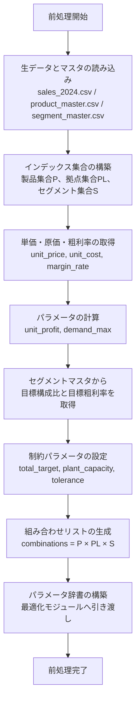
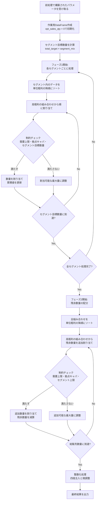
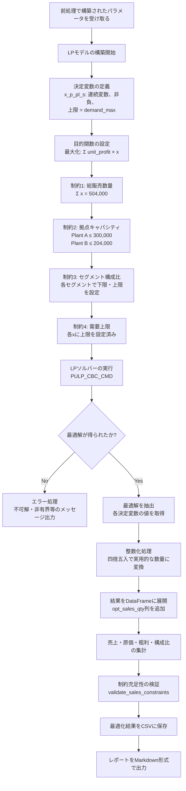

# 製品ポートフォリオ最適化レポート（2024年度）

生成日時: 2025-11-30

---

## 1. レポートの概要

本レポートは、2024年度のサンプルデータを用いて実施した製品ポートフォリオ最適化の結果を、現状（ベースライン）、貪欲法（Greedy）、線形計画法（LP）の3つのアプローチで比較・検証したものです。

製品ポートフォリオ最適化とは、限られた生産能力や市場需要の制約の中で、どの製品をどの拠点でどれだけ生産・販売するかを決定することで、全体の利益を最大化する取り組みです。本分析では、複数の製品、2つの生産拠点（Plant A、Plant B）、4つの顧客セグメント（industrial、electronics、oil_gas、others）を対象に、総販売数量504,000本を前提とした最適化を実施しました。

ベースラインとなる現状データに対し、貪欲法では単位粗利の高い組み合わせから順に数量を配分する方式を採用し、線形計画法では数理最適化モデルを用いて制約の範囲内で総粗利を厳密に最大化する方式を採用しています。本レポートでは、これら3つのシナリオについて、財務指標の比較、処理ロジックの詳細、および各手法の特徴と実務上の示唆を提示します。

### 1-1. 主要指標の比較表

以下の表は、現状（Current）、貪欲法（Greedy）、線形計画法（LP）の3つのシナリオにおける主要財務指標を比較したものです。

| 指標 | 現状（Current） | 貪欲法（Greedy） | 線形計画法（LP） | 最良 |
|------|----------------|------------------|------------------|------|
| 総販売数量 | 504,000本 | 504,000本 | 504,000本 | - |
| 総売上高 | ¥34,394,204,255 | ¥40,624,964,426 | ¥40,835,425,434 | LP |
| 総原価 | ¥27,713,042,315 | ¥32,381,345,804 | ¥32,121,832,451 | - |
| 総粗利 | ¥6,681,161,940 | ¥8,243,618,622 | ¥8,713,592,983 | LP |
| 全体粗利率 | 19.43% | 20.29% | 21.34% | LP |

この比較から、線形計画法が総粗利において最も優れた結果を示していることがわかります。現状と比較して、貪欲法は約23.4%（+¥1,562,456,682）、線形計画法は約30.4%（+¥2,032,431,043）の粗利改善を実現しています。また、線形計画法は貪欲法に対しても約5.7%（+¥469,974,360）の優位性を示しています。

**注記**: 総原価は各手法で最適化された販売数量と製品・拠点・セグメント組み合わせに応じて変動します。総売上高と総粗利がともに増加していることから、より高単価・高粗利の製品構成へと最適化が進んだことが示されています。

---

## 2. 前処理（共通モジュール）の説明

### 2-1. 一般的な役割の説明

最適化における前処理は、生データを最適化アルゴリズムが利用可能な形に整備する重要な工程です。主な役割として、以下が挙げられます。

まず、複数のデータソース（販売データ、生産データ、マスタデータ等）から必要な情報を読み込み、統合します。次に、最適化で使用するインデックス集合（製品、拠点、セグメント等）を構築し、各組み合わせに対するパラメータ（単価、原価、単位粗利、需要上限等）を計算します。さらに、制約条件を定義するためのパラメータ（総販売数量、拠点キャパシティ、セグメント構成比のターゲット等）を設定します。

前処理が適切に行われることで、最適化アルゴリズムは正確なデータに基づいて効率的に動作し、ビジネス要件を満たす実行可能な解を導出できます。逆に、前処理が不十分であれば、データの不整合や制約の誤設定により、最適化が失敗したり、実務上意味のない結果が得られたりする可能性があります。

### 2-2. 本ケースで実際に行っている前処理

本プロジェクトでは、`optimization_common_v4.py`モジュールが前処理を一元的に提供しています。以下、その処理内容を詳述します。

**データの読み込み**

`load_raw_data()`関数により、以下のファイルが読み込まれます。

- `data/raw/sales_2024.csv`: 2024年度の販売実績データ。各レコードは、製品コード、拠点、セグメント、販売数量、単価、原価等の情報を含みます。
- `data/master/product_master.csv`: 製品マスタデータ。製品の基本情報を管理します。
- `data/master/segment_master.csv`: セグメントマスタデータ。各セグメントの目標構成比（`segment_sales_mix`）と目標粗利率（`target_margin_rate`）を定義します。

**インデックス集合の構築**

`build_parameters()`関数内で、以下の集合が構築されます。

- **P（製品集合）**: 販売データに含まれるすべての製品コード
- **PL（拠点集合）**: 'A'と'B'の2拠点
- **S（セグメント集合）**: 'industrial'、'electronics'、'oil_gas'、'others'の4セグメント

これらの集合の直積（P × PL × S）が、最適化における決定変数の候補となる組み合わせ（`combinations`）を構成します。

**パラメータの計算**

各組み合わせ (p, pl, s) について、以下のパラメータが計算されます。

- **unit_price**: 販売単価（CSVから直接取得）
- **unit_cost**: 製造原価（CSVから直接取得）
- **margin_rate**: 粗利率（CSVから直接取得）
- **unit_profit**: 単位粗利 = unit_price × margin_rate（販売1本あたりの粗利額）
- **demand_max**: 需要上限 = 現状販売数量 × 2.0（過度な数量増加を防ぐ制約）

また、セグメントマスタから以下のパラメータが取得されます。

- **segment_mix**: 各セグメントの目標販売構成比（例: industrial = 40%）
- **target_margin**: 各セグメントの目標粗利率（例: oil_gas = 50%）

**制約パラメータの設定**

最適化で考慮すべき制約条件として、以下のパラメータが設定されます。

- **total_target**: 総販売数量 = 504,000本（年間目標）
- **plant_capacity**: 拠点別の生産能力制約
  - Plant A: 300,000本
  - Plant B: 204,000本
- **tolerance**: セグメント構成比の許容誤差 = ±3パーセントポイント（例: 目標40%に対し、37%～43%を許容）

**制約チェック機能**

`validate_sales_constraints()`関数は、最適化結果が以下の制約を満たしているかを検証します。

- 総販売数量が目標値（504,000本）と一致しているか
- 各拠点の販売数量が拠点キャパシティを超えていないか
- 各セグメントの販売構成比が目標値±3%の範囲内に収まっているか

これにより、最適化アルゴリズムが実行可能で現実的な解を生成していることが保証されます。

### 2-3. 前処理のフローチャート（Mermaid）

以下のフローチャートは、本ケースにおける前処理の流れを図示したものです。



このフローに従い、最適化アルゴリズム（GreedyまたはLP）が必要とするすべてのパラメータが準備され、一貫性のあるデータ構造が構築されます。

---

## 3. 貪欲法（Greedy）の説明と本ケースの結果

### 3-1. 貪欲法の一般的な説明

貪欲法（Greedy Algorithm）は、最適化や探索問題に対するヒューリスティック手法の一つです。その基本的な考え方は、「各局面において、その時点で最も有利な選択を行う」というものです。

具体的には、利益や評価値が高い選択肢から順に採用していき、制約を満たす範囲で解を構築します。この手法の利点は、計算が軽量で直感的に理解しやすく、大規模な問題にも適用可能である点です。一方、局所的な最良選択を積み重ねるため、全体最適解（厳密な最適解）が保証されない場合があります。

ビジネスの文脈では、「最も利益率の高い製品から販売枠を埋めていく」「最も効率の良い生産ラインから稼働させる」といった意思決定が貪欲法の典型例です。厳密な最適性よりも、実用的でそこそこ良い解を迅速に得ることが重視される場合に有効です。

### 3-2. 本ケースでの Greedy の処理内容

本プロジェクトの`optimize_portfolio_greedy_2024_v4.py`では、2段階の貪欲法アルゴリズムを採用しています。

**フェーズ1: セグメント目標数量の充足**

まず、各セグメント（industrial、electronics、oil_gas、others）に対して、目標販売数量（総販売数量 × 目標構成比）を確保します。各セグメント内で、単位粗利の高い組み合わせから順に数量を割り当てていきます。

この段階では、以下の制約を考慮しながら割り当てが行われます。

- 需要上限（demand_max = 現状販売数量 × 2.0）
- 拠点キャパシティ（Plant AおよびBの残容量）
- セグメント目標数量

例えば、industrialセグメントの目標が201,600本の場合、industrial内で最も単位粗利が高い組み合わせから順に数量を配分し、合計が201,600本に達するまで続けます。

**フェーズ2: 残余容量の配分**

フェーズ1で各セグメントの目標数量を満たした後、総販売数量504,000本に未達の場合、残余数量をすべての組み合わせの中から単位粗利の高い順に配分します。

この段階では、さらに以下の上限制約を考慮します。

- 各組み合わせの需要上限（すでにフェーズ1で割り当てられた数量との合計が上限を超えないように）
- 拠点キャパシティの残量
- セグメント構成比の上限（目標構成比 + 3%）

最終的に、整数化（四捨五入）による微調整を行い、総販売数量がちょうど504,000本になるように補正します。

この2段階のアプローチにより、セグメント構成比を目標に近づけつつ、高粗利の組み合わせを優先的に選択することで、実用的な最適化を実現しています。

### 3-3. Greedy の処理フローチャート（Mermaid）

以下のフローチャートは、貪欲法アルゴリズムの処理フローを示しています。



このフローにより、セグメント構成比の目標を遵守しつつ、高粗利の組み合わせを優先的に選択する貪欲法の処理が実行されます。

### 3-4. Greedy の結果サマリー

貪欲法による最適化結果は以下の通りです。

**全体指標**

- **総販売数量**: 504,000本（目標達成）
- **総売上高**: ¥40,624,964,426
- **総原価**: ¥32,381,345,804
- **総粗利**: ¥8,243,618,622
- **全体粗利率**: 20.29%

現状（粗利率19.43%）と比較して、粗利率が0.86ポイント向上し、総粗利は約15.6億円増加しています。

**拠点別数量**

| 拠点 | 販売数量 | 構成比 | キャパシティ | 稼働率 |
|------|---------|--------|------------|--------|
| A | 300,000本 | 59.5% | 300,000本 | 100.0% |
| B | 204,000本 | 40.5% | 204,000本 | 100.0% |

両拠点ともキャパシティを完全に使い切っており、生産能力を最大限活用しています。

**セグメント別数量と構成比**

| セグメント | 販売数量 | 構成比 | 目標構成比 | 差異 | 粗利 | 粗利率 |
|-----------|---------|--------|----------|------|------|--------|
| industrial | 201,600本 | 40.0% | 40.0% | 0.0pp | ¥1,815,253,469 | 11.39% |
| electronics | 126,000本 | 25.0% | 25.0% | 0.0pp | ¥2,112,880,932 | 21.61% |
| oil_gas | 50,400本 | 10.0% | 10.0% | 0.0pp | ¥2,217,152,528 | 50.42% |
| others | 126,000本 | 25.0% | 25.0% | 0.0pp | ¥2,098,331,693 | 19.97% |

貪欲法の大きな特徴は、すべてのセグメントで構成比が目標値とぴったり一致している点です。これはフェーズ1で各セグメントの目標数量をきっちり確保する設計になっているためです。また、各セグメントの粗利率も目標粗利率を上回っており、高粗利の組み合わせが優先的に選択されたことがわかります。

---

## 4. LP（線形計画法）の説明と本ケースの結果

### 4-1. LP の一般的な説明

線形計画法（Linear Programming, LP）は、数理最適化手法の一つで、線形の目的関数を線形の制約条件のもとで最大化または最小化する問題を解く手法です。

基本的な構成要素は以下の通りです。

- **決定変数**: 最適化の対象となる変数（例: 各製品の生産数量）
- **目的関数**: 最大化または最小化したい指標を決定変数の線形式で表したもの（例: 総粗利 = Σ(単位粗利 × 販売数量)）
- **制約条件**: 決定変数が満たすべき条件を線形不等式または等式で表したもの（例: 総販売数量 = 504,000、拠点キャパシティ ≤ 300,000）

線形計画法の利点は、制約を満たす範囲内で厳密な最適解を数理的に導出できる点です。大規模な問題でも、専用のソルバー（CBC、Gurobi、CPLEX等）を用いることで効率的に解くことが可能です。

一方、モデル化の前提（線形性、変数の連続性等）が実務の状況と合致しない場合、得られた解が実用的でない可能性があります。また、制約条件の設定次第では実行可能解が存在しない（不可解）場合もあります。

貪欲法と比較すると、線形計画法は「全体を見渡して最適解を見つける」アプローチであり、厳密性と最適性を重視する場合に適しています。

### 4-2. 本ケースでの LP モデルと処理内容

本プロジェクトの`optimize_portfolio_lp_2024_v4.py`では、PuLPライブラリを用いて以下のLPモデルを構築しています。

**決定変数**

各組み合わせ (p, pl, s) に対して、最適販売数量 x[p, pl, s] を決定変数とします。

- **x[p, pl, s]**: 製品p、拠点pl、セグメントsの組み合わせにおける販売数量（連続変数、非負）

**目的関数**

総粗利を最大化します。

```
最大化: Σ(unit_profit[p, pl, s] × x[p, pl, s])
```

ここで、unit_profit[p, pl, s] = unit_price[p, pl, s] × margin_rate[p, pl, s] です。

**制約条件**

本モデルでは以下の4種類の制約が設定されています。

1. **総販売数量制約**

   ```
   Σ x[p, pl, s] = 504,000
   ```

   すべての組み合わせの販売数量の合計が目標値と一致する必要があります。

2. **拠点キャパシティ制約**

   ```
   Σ x[p, 'A', s] ≤ 300,000  （Plant A）
   Σ x[p, 'B', s] ≤ 204,000  （Plant B）
   ```

   各拠点で生産・販売される総数量が、その拠点のキャパシティを超えないようにします。

3. **セグメント販売構成比制約**

   各セグメントsに対して、

   ```
   504,000 × (target_mix[s] - 0.03) ≤ Σ x[p, pl, s] ≤ 504,000 × (target_mix[s] + 0.03)
   ```

   例えば、industrialセグメント（目標構成比40%）の場合、

   ```
   504,000 × 0.37 ≤ Σ x[p, pl, 'industrial'] ≤ 504,000 × 0.43
   186,480 ≤ Σ x[p, pl, 'industrial'] ≤ 216,720
   ```

   となります。目標から±3%の範囲内で構成比を調整できるようにすることで、柔軟性を持たせつつ全体最適を追求します。

4. **需要上限制約**

   ```
   0 ≤ x[p, pl, s] ≤ demand_max[p, pl, s]
   ```

   各組み合わせの販売数量は、需要上限（現状販売数量の2倍）を超えないようにします。

**処理の流れ**

LPモデルは以下の流れで処理されます。

1. `build_lp_model()`関数でLPモデルを構築
2. PuLPの`PULP_CBC_CMD`ソルバーを用いてモデルを解く
3. 最適解が得られた場合、各決定変数の値を抽出
4. 実用性のため、解を整数化（四捨五入）
5. 結果をCSVに保存し、制約充足性を検証

線形計画法では、貪欲法のような段階的な処理ではなく、すべての決定変数を同時に考慮して全体最適解を導出します。そのため、セグメント構成比の柔軟性を活用し、より高粗利のセグメントに数量を寄せることで、総粗利を最大化しています。

### 4-3. LP の処理フローチャート（Mermaid）

以下のフローチャートは、線形計画法の処理フローを示しています。



このフローにより、数理的に厳密な最適解が導出され、すべての制約を満たしつつ総粗利を最大化する販売数量が決定されます。

### 4-4. LP の結果サマリー

線形計画法による最適化結果は以下の通りです。

**全体指標**

- **総販売数量**: 504,000本（目標達成）
- **総売上高**: ¥40,835,425,434
- **総原価**: ¥32,121,832,451
- **総粗利**: ¥8,713,592,983
- **全体粗利率**: 21.34%

貪欲法（粗利率20.29%）と比較して、粗利率が1.05ポイント向上し、総粗利は約4.7億円増加しています。また、現状と比較すると、粗利率は1.91ポイント向上し、総粗利は約20.3億円増加しています。

**拠点別数量**

| 拠点 | 販売数量 | 構成比 | キャパシティ | 稼働率 |
|------|---------|--------|------------|--------|
| A | 300,000本 | 59.5% | 300,000本 | 100.0% |
| B | 204,000本 | 40.5% | 204,000本 | 100.0% |

貪欲法と同様に、両拠点ともキャパシティを完全に使い切っています。

**セグメント別数量と構成比**

| セグメント | 販売数量 | 構成比 | 目標構成比 | 差異 | 粗利 | 粗利率 |
|-----------|---------|--------|----------|------|------|--------|
| industrial | 186,480本 | 37.0% | 40.0% | -3.0pp | ¥1,717,677,814 | 11.47% |
| electronics | 118,336本 | 23.5% | 25.0% | -1.5pp | ¥1,990,361,578 | 21.39% |
| oil_gas | 65,520本 | 13.0% | 10.0% | +3.0pp | ¥2,721,301,217 | 50.43% |
| others | 133,664本 | 26.5% | 25.0% | +1.5pp | ¥2,284,252,374 | 20.47% |

線形計画法の特徴は、セグメント構成比が目標値から若干ずれている点です。特に、oil_gasセグメントが目標10%に対して13.0%（+3.0pp）、industrialセグメントが目標40%に対して37.0%（-3.0pp）となっています。

これは、LPモデルがセグメント構成比制約（±3%の許容範囲）を活用し、粗利率の高いoil_gasセグメント（粗利率50.43%）の比率を制約上限まで引き上げ、粗利率が相対的に低いindustrialセグメント（粗利率11.47%）の比率を制約下限まで引き下げることで、総粗利を最大化しているためです。

貪欲法ではセグメント構成比を厳密に目標値に合わせる設計でしたが、線形計画法では全体最適を追求するため、許容範囲内でセグメント配分を調整し、より高い利益を実現しています。

---

## 5. 結果の比較と考察（詳細）

本章では、現状、貪欲法、線形計画法の3つのシナリオを詳細に比較し、各手法の特徴と実務上の示唆を考察します。

### 5-1. 指標レベルでの比較

以下の表は、3つのシナリオにおける主要財務指標の詳細比較です。

**総粗利の比較**

| シナリオ | 総粗利 | 現状からの差分（金額） | 現状からの差分（%） |
|---------|--------|---------------------|-------------------|
| 現状（Current） | ¥6,681,161,940 | - | - |
| 貪欲法（Greedy） | ¥8,243,618,622 | +¥1,562,456,682 | +23.39% |
| 線形計画法（LP） | ¥8,713,592,983 | +¥2,032,431,043 | +30.42% |

| 比較 | 差分（金額） | 差分（%） |
|------|------------|----------|
| LP vs Greedy | +¥469,974,360 | +5.70% |

線形計画法が最も高い総粗利を達成しています。現状と比較すると、貪欲法で約15.6億円、線形計画法で約20.3億円の改善が見込まれます。また、貪欲法と線形計画法を比較すると、線形計画法が約4.7億円の優位性を示しています。

**粗利率の比較**

| シナリオ | 粗利率 | 現状からの差分 |
|---------|--------|--------------|
| 現状（Current） | 19.43% | - |
| 貪欲法（Greedy） | 20.29% | +0.86pp |
| 線形計画法（LP） | 21.34% | +1.91pp |

粗利率においても、線形計画法が最も優れた結果を示しています。これは、線形計画法が高粗利セグメントへの配分を最大化する設計になっているためです。

**総売上高の比較**

| シナリオ | 総売上高 | 現状からの差分（金額） | 現状からの差分（%） |
|---------|---------|---------------------|-------------------|
| 現状（Current） | ¥34,394,204,255 | - | - |
| 貪欲法（Greedy） | ¥40,624,964,426 | +¥6,230,760,171 | +18.11% |
| 線形計画法（LP） | ¥40,835,425,434 | +¥6,441,221,179 | +18.73% |

総売上高も大幅に増加しています。これは、最適化により高単価の製品・セグメント組み合わせが優先的に選択されたためです。

**セグメント構成比の比較**

| セグメント | 目標構成比 | 現状 | 貪欲法 | 線形計画法 |
|-----------|----------|------|--------|----------|
| industrial | 40.0% | 39.9% | 40.0% | 37.0% |
| electronics | 25.0% | 24.9% | 25.0% | 23.5% |
| oil_gas | 10.0% | 9.9% | 10.0% | 13.0% |
| others | 25.0% | 25.3% | 25.0% | 26.5% |

現状と貪欲法は目標構成比にほぼ一致していますが、線形計画法は±3%の許容範囲を活用して、oil_gasとothersの比率を高め、industrialとelectronicsの比率を下げています。

### 5-2. 配分の違いに焦点を当てた解説

各手法の「考え方」と「処理方法」が、今回の配分の違いをどのように生んだのかを詳しく解説します。

**貪欲法の配分ロジック**

貪欲法は2段階のアプローチを採用しています。

1. **フェーズ1**: 各セグメントに対して、目標構成比に応じた数量（例: industrial = 40% = 201,600本）を厳密に確保します。各セグメント内で単位粗利の高い組み合わせから順に割り当てるため、セグメント内では高粗利の製品・拠点組み合わせが優先されます。

2. **フェーズ2**: 残余数量（通常は発生しませんが、フェーズ1の端数処理で生じる場合がある）を、全セグメントを通じて単位粗利の高い順に配分します。

この設計により、貪欲法はセグメント構成比をターゲット通りに維持しつつ、各セグメント内で高粗利の組み合わせを選択します。結果として、目標構成比を守りながらも、現状（粗利率19.43%）より高い粗利率（20.29%）を実現しています。

ただし、セグメント構成比を固定することで、セグメント間での最適化の余地が制限されます。例えば、oil_gasセグメント（粗利率50.42%）の比率を10%に固定せず、許容範囲内で増やすことができれば、さらに総粗利を向上させる可能性があります。

**線形計画法の配分ロジック**

線形計画法は、すべての決定変数（各組み合わせの販売数量）を同時に考慮し、制約を満たす範囲で総粗利を最大化する数理最適化を行います。

セグメント構成比制約として、目標構成比±3%の範囲が設定されているため、LPソルバーはこの柔軟性を最大限活用します。具体的には、以下のような配分が行われています。

- **oil_gasセグメント**: 粗利率が最も高い（50.43%）ため、構成比を制約上限である13.0%（目標10% + 3%）まで引き上げています。これにより、oil_gasの販売数量は50,400本（貪欲法）から65,520本（LP）へ約15,000本増加しています。

- **othersセグメント**: 粗利率が20.47%と比較的高いため、構成比を26.5%（目標25% + 1.5%）に引き上げています。これにより、othersの販売数量は126,000本（貪欲法）から133,664本（LP）へ約7,600本増加しています。

- **industrialセグメント**: 粗利率が最も低い（11.47%）ため、構成比を制約下限である37.0%（目標40% - 3%）まで引き下げています。これにより、industrialの販売数量は201,600本（貪欲法）から186,480本（LP）へ約15,000本減少しています。

- **electronicsセグメント**: 粗利率が21.39%と中程度のため、構成比を23.5%（目標25% - 1.5%）に調整しています。これにより、electronicsの販売数量は126,000本（貪欲法）から118,336本（LP）へ約7,600本減少しています。

このセグメント間での配分調整により、線形計画法は貪欲法と比較して約4.7億円の粗利改善を実現しています。

**具体例: oil_gasセグメントの増加**

oil_gasセグメントは、貪欲法で50,400本、線形計画法で65,520本と、約15,000本増加しています。粗利率が50.43%と非常に高いため、この増加分だけで約7.6億円の粗利増加に寄与していると推定されます（厳密には組み合わせごとの単価・原価が異なるため概算）。

一方、industrialセグメントは、粗利率が11.47%と低いため、約15,000本減少させることで、低粗利部分を削減し、その分を高粗利セグメントに振り向けています。

**処理方法の違いがもたらす影響**

貪欲法は「局所的に最良の選択を積み重ねる」アプローチであり、セグメントごとに独立して最適化を行います。そのため、セグメント間での配分調整ができず、全体最適には至りません。

一方、線形計画法は「全体を見渡して最適解を探す」アプローチであり、すべての決定変数を同時に考慮して制約の範囲内で最良の配分を見つけます。セグメント構成比の柔軟性を活用することで、貪欲法では達成できない全体最適解を導出しています。

### 5-3. まとめ

本分析から得られる主な示唆は以下の通りです。

**1. 線形計画法の優位性**

線形計画法は、制約を満たす範囲内で厳密な最適解を導出するため、総粗利において最も優れた結果を示しました。セグメント構成比の許容範囲（±3%）を活用することで、高粗利セグメントへの配分を最大化し、現状と比較して約30.4%の粗利改善、貪欲法と比較して約5.7%の粗利改善を実現しています。

ただし、線形計画法はモデル化の前提に依存します。例えば、セグメント構成比の許容範囲を±3%から±1%に変更すると、最適解が変わり、総粗利も変動します。また、需要上限や拠点キャパシティ等の制約パラメータが実務の状況と乖離している場合、得られた解が実用的でない可能性があります。

**2. 貪欲法のシンプルさと実用性**

貪欲法は、セグメント構成比を目標値に厳密に合わせつつ、各セグメント内で高粗利の組み合わせを優先する直感的なアプローチです。線形計画法と比較すると総粗利は約5.7%劣りますが、現状と比較して約23.4%の粗利改善を実現しており、実用的な水準と言えます。

また、貪欲法は計算が軽量で、大規模なデータセットにも容易に適用できます。さらに、セグメント構成比を目標通りに維持するため、マーケティング戦略や顧客関係管理の観点から望ましい場合もあります。

**3. 実務における使い分け**

両手法にはそれぞれの強みがあり、実務では以下のような使い分けが考えられます。

- **厳密な最適性を重視する場合**: 線形計画法を採用し、制約の範囲内で総粗利を最大化します。ただし、制約パラメータ（セグメント構成比の許容範囲等）が現実的で適切に設定されていることを確認する必要があります。

- **セグメント構成比を重視する場合**: 貪欲法を採用し、セグメント構成比を目標通りに維持しつつ、高粗利の組み合わせを選択します。特に、顧客との契約や市場戦略上、セグメント比率を守ることが重要な場合に有効です。

- **初期分析や迅速な意思決定が必要な場合**: 貪欲法のシンプルさと計算速度を活かし、迅速に実用的な解を得ます。

- **What-If分析やシナリオ比較**: 両手法を併用し、異なるアプローチの結果を比較することで、意思決定の幅を広げます。

**4. 制約の重要性**

本分析では、セグメント構成比の許容範囲（±3%）が重要な役割を果たしています。この許容範囲が狭すぎると、線形計画法でも自由度が制限され、最適化の効果が薄れます。逆に、許容範囲が広すぎると、セグメント構成比が大きく偏り、ビジネス上の要件を満たさない可能性があります。

実務では、ビジネス要件、市場動向、顧客ニーズ等を考慮して、制約パラメータを適切に設定することが最適化の成否を左右します。

**5. 継続的な改善の可能性**

本分析では、需要上限を「現状販売数量 × 2.0」と設定していますが、この値は仮定です。実際の市場需要や生産能力をより正確に反映することで、さらに精度の高い最適化が可能になります。

また、製品ライフサイクル、季節変動、原材料コストの変動等、動的な要因を考慮した多期間最適化や確率的最適化へと発展させることも検討に値します。

**結論**

製品ポートフォリオ最適化において、貪欲法は直感的で実用的なアプローチであり、線形計画法は厳密性と最適性を追求するアプローチです。両者を理解し、適切に使い分けることで、ビジネス目標の達成と利益最大化を両立させることができます。

本分析の結果は、2024年度のサンプルデータに基づくものですが、得られた知見は実務における最適化手法の選択と適用において、有益な示唆を提供するものと考えます。

---

## 付録: データソースと制約条件

**使用データ**

- ベースライン: `data/raw/sales_2024.csv`
- 貪欲法最適化結果: `data/processed/sales_2024_opt_greedy_v4.csv`
- 線形計画法最適化結果: `data/processed/sales_2024_opt_lp_v4.csv`
- 製品マスタ: `data/master/product_master.csv`
- セグメントマスタ: `data/master/segment_master.csv`

**制約条件**

- 総販売数量: 504,000本
- 拠点キャパシティ: Plant A = 300,000本、Plant B = 204,000本
- セグメント目標構成比: industrial = 40%、electronics = 25%、oil_gas = 10%、others = 25%
- セグメント構成比許容範囲: ±3パーセントポイント
- 需要上限: 現状販売数量 × 2.0

**参考スクリプト**

- 前処理: `scripts/optimization_common_v4.py`
- 貪欲法最適化: `scripts/optimize_portfolio_greedy_2024_v4.py`
- 線形計画法最適化: `scripts/optimize_portfolio_lp_2024_v4.py`
- 比較分析: `scripts/compare_optimization_2024_v4.py`

---

**レポート作成者**: Claude Code Analyst
**生成日時**: 2025-11-30
**バージョン**: v4
